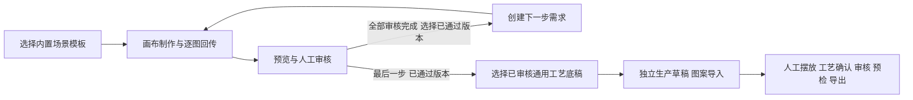

# 创意画布场景工作流

日期：2026-09-09。适用范围：本地 ERP 创意工作台与独立 Infinite Canvas 插件 1.1.0。

## 交互来源与取舍

参考灵图 POD 实际页面与其[工作流手册](https://lingtuipoddy.feishu.cn/wiki/L9ZVw2HxuiXwFVk0VZOcXxm8nNh)、[批量工具说明](https://lingtuipoddy.feishu.cn/wiki/GIbewuQnjiG55dk49t2c1122n9g)、[生产图说明](https://lingtuipoddy.feishu.cn/wiki/FMVjwcdO5it7S3kyRMDcw8vxnTe)。采用场景模板、任务结果集中筛选、人工审核后继续、生产模板关联这些交互模式；使用本项目自己的实现与素材规则。

入口为“创意设计 → 创意工作台”，搜索“创意画布”仍可找到。桌面显示最近项目侧栏，小屏用原生下拉切换项目。项目列表按根需求合并，只显示最新步骤；历史步骤通过工作区顶部步骤条访问。React Bits SpotlightCard 只用于模板选择，遵守 reduced-motion；其余使用 ERP 原有色彩、图标、表单和状态样式。

## 状态与执行

场景模板固定为自由创作、原创图案、备胎罩、异形抱枕。模板及步骤在创建时生成不可变快照。创作说明可在下一步创建前补充；每步最多回传 4 个方案。创建/继续只保存任务，不自动触发生图。真实制作由操作者在原版画布执行；显示出的步骤节点属于工作指引，不能冒充自动算法执行记录。

所有方案都必须审核：待审核方案不进入后继，退回方案不作为后继参考。下一步只复制已批准的素材版本和校验值。同一父步骤只创建一个后继；创建后父步骤停止接收新方案。普通单步历史需求继续可读、可审核。

## 与其他模块的边界

- 既有工作流引擎依赖已存在的 Product Plan；本功能服务于 SKU 前的创作，复用创意批次/版本，避免伪造商品企划。
- 创意母版与正式 SKU 设计继续分开。此处的生产编辑器交接不替代正式 SKU 绑定、场景套图或刊登审核。
- 买家照片只通过订单报告与生产编辑器的受保护来源链路处理；竞品素材不进入创作参考或生产交付。
- 产品工艺底稿来自已审核的通用生产项目当前版本，必须与场景产品类型相符。只复用工艺参数与轮廓，图文与确认状态不继承。原图按比例居中，异形轮廓、摄像头孔位、缝边、实际尺寸需要按工厂要求人工复核。
- 原版上游源码、镜像与 SDK 类型文件保持原样。插件使用公开 SDK 添加步骤、需求、参考图片与连线；不读取宿主内部 store 或直接写宿主数据库。

生产稿和工艺底稿通过同页编辑会话打开；返回时保留当前项目、方案选择和筛选。订单来图在独立的订单工作台中采用相同编辑会话，不混入创意素材库。旧批量生图、图片处理与校样页面作为辅助工具保留，完整交互边界见 [ERP navigation](erp-navigation.md)。

详细 API、持久化、重试及认证边界见[接入文档](../integration/infinite-canvas.md)。本版不包含自由拖拽配置任意算法、自动批量生图、完整模板管理库、订单 SKU 自动匹配或公网多人 OIDC 会话。这些能力应基于后续明确的处理器与工艺需求分别实现。
