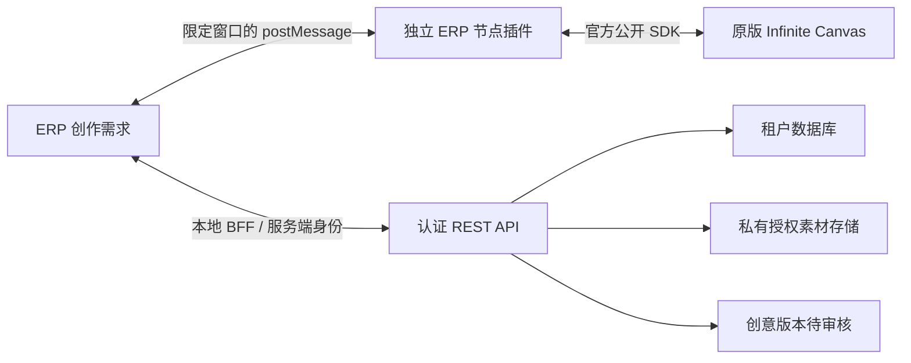

# Infinite Canvas 接入

## 范围与入口

ERP 左侧 **创意设计 → 创意画布** 对应 `/creative-designs/canvas`。工作台集中提供场景模板、最近项目、方案预览与筛选、审核、下一步和生产工艺关联；原版画布独立运行。`/creative-designs?batch=<id>` 保留为版本详情入口。

插件 1.1.0 支持自由创作、原创图案、备胎罩、异形抱枕四种起点。自由创作为一步，其余包含两个创作步骤。每步最多 10 张授权参考图、4 个回传方案，支持逐图或批量回传。所有方案审核完成后，操作者选中已通过方案创建下一步；通过的原图自动成为下一步参考。已继续的旧步骤停止接收新方案，原提交仍能幂等重放。创建任务不会自动调用模型，也不把创意母版视为可直接送印的生产文件。

最后一步可关联当前已审核、没有订单来源的生产编辑器项目，将其作为**工艺底稿**：固定模板版本、复制尺寸/参数/轮廓、导入已批准原图、创建独立生产草稿。模板图文不复制，原模板不更改，新草稿全部工艺确认和审核状态重置。图片按比例居中放入，需人工调整与预检；异形抱枕尤其需要依据新主体重新核对轮廓。

## 独立边界

- `infra/infinite-canvas.compose.yml` 直接使用官方镜像摘要，没有补丁、源码 fork 或文件覆盖。
- `packages/infinite-canvas-plugin` 使用宿主 React、节点查询、`applyOps` 和插件私有存储。只添加自己的节点与连接，不引用内部 store、私有 DOM 或宿主数据库。
- SDK 类型来自固定提交，原文件和 MIT 许可证保留在 `vendor/`。协议集中在 `packages/contracts/src/pod/canvas-bridge.ts`。
- 原版插件机制在同一个页面执行代码，不是插件沙箱。ERP 凭据不进入画布，插件只接收当前需求的最小数据。
- 原版保存自己的图与媒体；ERP 仅保存需求和提交结果，不能替代原版完整项目 ZIP 备份。

## API

租户从认证成员身份解析，数据访问通过 `withTenant()`，不接受前端指定租户。

| 方法与路径 | 用途 |
| --- | --- |
| `GET /v1/canvas-bridge/options` | 可用授权素材 |
| `GET /v1/canvas-bridge/briefs` | 当前租户最近 200 条画布需求 |
| `POST /v1/canvas-bridge/briefs` | 固定需求及素材版本，`requestId` 幂等 |
| `GET /v1/canvas-bridge/briefs/:id` | 当前需求与素材摘要 |
| `GET /v1/canvas-bridge/briefs/:id/assets/:assetId` | 读取绑定素材字节，返回 Base64 |
| `POST /v1/canvas-bridge/briefs/:id/results` | 提交图片与来源，`submissionId` 幂等 |
| `GET /v1/canvas-bridge/briefs/:id/results` | 当前步骤的方案、审核状态与生产关联 |
| `GET /v1/canvas-bridge/briefs/:id/results/:versionId/preview` | 受认证保护的 WebP 缩略图，最长边 800 px，禁止缓存 |
| `POST /v1/canvas-bridge/briefs/:id/review` | 逐版本复用审核服务，返回各项成功或冲突，需 `DesignReview` |
| `POST /v1/canvas-bridge/briefs/:id/continue` | `versionIds` + `prompt`，当前步骤全部审核后才可继续 |
| `GET /v1/canvas-bridge/production-templates` | 当前租户最近 50 个已审核通用工艺底稿 |
| `POST /v1/canvas-bridge/briefs/:id/production` | `versionId` + `templateProjectId` + `templateVersionId`，创建或返回生产草稿 |
| `POST /v1/pod/creative-design-versions/:id/review` | 复用创意审核服务 |

读需要 `DesignRead`、`AssetRead`，创建还需要 `DesignWrite`，回传还需要 `AssetWrite`；审核继续使用独立审核权限。

创建字段：`requestId`、`name`、`prompt`、可选 `negativePrompt`、`referenceAssetIds`、`templateKey`（默认 `freeform`）。模板只接受内置键，前端不能提交任意工作流定义。参考图必须在 authorized 域、权利已批准、未删除，且不是竞品或客户私有图。创建时固定版本和 SHA-256，读取与回传重新校验。

提交字段：`submissionId`、`protocolVersion`、`pluginVersion`、`upstreamVersion`、`sourceNodeId`、`title`、`contentBase64`、`rightsAttested: true`、`sourceKind`、`sourceReference`。只接收可完整解码的静态 PNG/JPG/WebP，每张不超过 20 MiB、6400 万像素，保留原字节。SVG、动画、伪造图片、未知协议或版本拒绝；TIFF 等最终生产格式仍由生产作图模块生成。

并发相同提交只创建一个资产、候选和版本；同一个提交号换图片或来源说明返回冲突。新提交永远创建新记录，不覆盖已批准版本。回传资产初始 `unverified`，版本 `pending_review`；人工批准后才成为可复用授权资产。审核不会直接绑定 SKU 或刊登。

## 浏览器连接与认证

ERP 打开独立窗口，URL 只传公共 ERP origin 和随机连接 ID。上游 `/canvas?mode=recent` 重定向保留 query、不保留普通 hash，因此连接参数使用 query。需求内容、图片、凭据不放入 URL。

双向消息同时验证 `event.origin`、`event.source`、协议和连接 ID；ERP 将消息限制在选中的需求。连接有效期 1 小时，离开 ERP 页面后失效，最多同时处理 3 个请求。插件以图片、节点、标题与来源计算重试身份，保存到插件私有存储。

Web 的 `/api/canvas-bridge/[...path]` 是 **仅限 loopback 开发环境** 的 BFF，拒绝跨源写入和生产模式，使用现有本地服务身份。生产网站的用户 OIDC 会话尚未实现：多人部署前须完成用户会话 BFF、CSRF 与成员权限验收，或实现受支持的用户 OIDC API 客户端。不能直接解除生产限制，也不能把本地服务身份开放到公网。API 保留 JWT、权限与 RLS 边界。

## 数据与构建

迁移 `0065_infinite_canvas_bridge.sql` 为 `creative_design_batches` 添加 `execution_mode`，默认 `processor`；画布任务用 `infinite_canvas`。复用现有需求、候选、创意版本、资产与审计表。普通 processor 创建仍要求印刷规格，画布任务允许创意母版单独审核。

`0066_canvas_workflow_workbench.sql` 添加每一步的 `canvas_workflow` 快照和 `canvas_production_handoffs` 关联表；`0067_canvas_snapshot_immutability.sql` 阻止快照更新。快照保存模板版本、完整步骤、当前步骤、父/根需求和已批准来源版本。每个父步骤最多一个后继，父批次锁与唯一索引保护并发。历史无快照需求继续按单步自由创作展示。

生产关联表强制 RLS、租户复合外键与不可变记录，同一创意版本/底稿版本只保留一条关联。文件扫描、加密、项目与版本创建复用 `ProductionEditorService`；失败时对新建项目执行密钥擦除补偿。多服务写入不是跨进程原子事务：进程在创建项目与写关联之间退出时，可能留下未关联草稿，需按审计记录核对，不能将它视作已完成生产交付。

`pnpm canvas:build` 构建插件并发布到本地 Web 公开 `/plugins/yummyai-bridge-1.1.0.js`，同时输出许可证与 SHA-256 manifest。仅公开插件文件允许跨源读取，业务 API 不开放跨源访问。生成文件不纳入 Git，Web dev/build 自动构建。插件仅通过官方 `add_node` / `connect_nodes` 在画布显示流程步骤、需求和参考图；已有节点不改写。详见[运行手册](../operations/infinite-canvas.md)。
