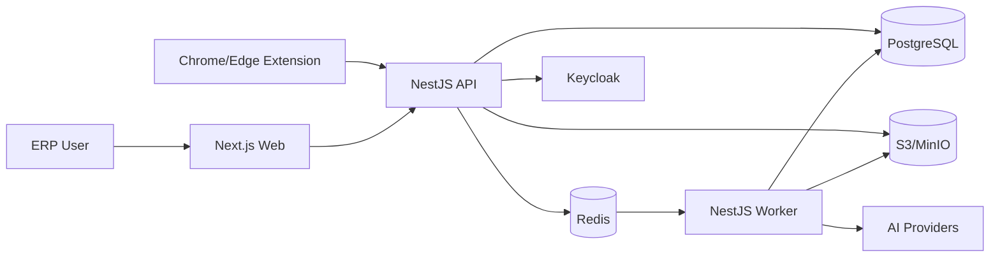

# YummyAI ERP P0 Implementation Plan

> **For agentic workers:** REQUIRED SUB-SKILL: Use superpowers:subagent-driven-development (recommended) or superpowers:executing-plans to implement this plan task-by-task. Steps use checkbox (`- [ ]`) syntax for tracking.

**Goal:** Build the P0 vertical slice from Amazon/Etsy browser capture through evidence-based AI analysis, product/design management, reviewed Listing creation, and export.

**Architecture:** Use a TypeScript modular monolith in a pnpm monorepo. Next.js serves the ERP UI, NestJS owns the REST/OpenAPI boundary, a separate NestJS worker runs BullMQ jobs, and a WXT Manifest V3 extension captures visible marketplace pages. PostgreSQL is the system of record, Redis coordinates jobs and caching, and S3-compatible object storage holds media and design assets.

**Tech Stack:** Node.js 24, pnpm 11, TypeScript 5.9+, Next.js 16 + React 19, NestJS 11, WXT + React, PostgreSQL 17, Drizzle ORM, Redis 8 + BullMQ, Keycloak 26, MinIO/S3, Zod, Vercel AI SDK provider adapters, Tailwind CSS 4 + Radix/shadcn, TanStack Query/Table, Vitest, Supertest, Testcontainers, Playwright, OpenTelemetry, Pino, and Sentry.

## Global Constraints

- Execute from a valid clone or isolated worktree of `https://github.com/ymyspirit/YummyAi`; the current local `.git` directory is empty and is not a valid repository.
- Install Docker Desktop or another Docker-compatible runtime before Tasks 3-15; it is not currently available on this machine.
- Use Node.js `24.17.x` and pnpm `11.10.x`; commit `pnpm-lock.yaml`.
- Store all timestamps as UTC and render them in the user's configured timezone.
- Use UUIDv7 identifiers for business entities and idempotency keys for external/background operations.
- Every business table carries `tenant_id`; PostgreSQL RLS is defense in depth, not a replacement for tenant-scoped repositories.
- Research assets and authorized assets use separate object prefixes, API policies, and permissions.
- P0 never publishes to Amazon/Etsy and never automates seller-console UI; it validates and exports reviewed assets only.
- Model names are configuration data. Do not hard-code Claude, GLM, GPT, or image model identifiers in business logic.
- AI facts require evidence references; unsupported statements must be stored as inferences or recommendations.
- API keys and future store tokens are encrypted at rest and never returned to the browser after creation.
- Capture, media processing, AI, export, and report aggregation are asynchronous jobs with progress, cancellation, timeout, and retry state.
- Keep the P0 deployable as one web service, one API service, one worker service, PostgreSQL, Redis, Keycloak, and S3-compatible storage.

---

## Technical Selection

### Architecture Decisions

| Area | Selection | Reason | Deferred alternative |
| --- | --- | --- | --- |
| Service shape | Modular monolith with separate worker process | Strong module boundaries without distributed-system overhead | Split hot modules into services only after measured scaling pressure |
| Monorepo | pnpm workspaces + Turborepo | Shared contracts, deterministic builds, selective CI | Nx is unnecessary for P0 |
| Web | Next.js App Router + React Server Components where appropriate | Mature admin UI, routing, SSR, streaming, and ecosystem | SPA-only Vite app adds a separate server concern |
| API | NestJS REST + OpenAPI | Explicit modules, guards, validation, background integration | GraphQL is not needed for known ERP workflows |
| Progress updates | Server-Sent Events | One-way job progress is simpler than WebSockets | WebSockets only if collaborative editing becomes real-time |
| Extension | WXT Manifest V3 + React | Chrome/Edge packaging, content scripts, typed extension APIs | Hand-written MV3 build pipeline is unnecessary |
| Database | PostgreSQL 17 + Drizzle | Relational integrity, JSONB, FTS, migrations, transparent SQL | Elasticsearch deferred until Postgres search is measured insufficient |
| Tenancy | Shared schema + tenant_id + scoped repositories + RLS | Internal-first deployment with SaaS-ready isolation | Database-per-tenant is too expensive for P0 |
| Identity | Keycloak OIDC/PKCE; app database owns organizations and permissions | Mature login/token flows for web and extension | Custom password storage is rejected |
| Jobs/cache | Redis 8 + BullMQ | Retry, backoff, progress, delayed jobs, cancellation | Kafka is unnecessary at current scale |
| Files | MinIO locally, S3/R2-compatible storage in production | Same API for media, design source files, and exports | Database blobs are rejected |
| AI | Internal `ModelProvider` interface backed by Vercel AI SDK adapters | Multi-provider routing and structured output without leaking provider APIs | LangChain is avoided until orchestration complexity warrants it |
| Search | PostgreSQL FTS + `pg_trgm` | Adequate for P0 research and product filters | OpenSearch deferred |
| UI system | Tailwind CSS 4 + Radix/shadcn + TanStack Table | Dense work-focused UI with accessible primitives | Full theme-heavy admin templates are rejected |
| Testing | Vitest + Supertest + Testcontainers + Playwright | Fast unit tests and realistic tenant/storage/job integration | Mock-only database tests are insufficient |
| Observability | Pino + OpenTelemetry + Sentry | Structured logs, traces, errors, and job correlation | Full metrics stack can be added at production scale |

### Deployment Topology



### Repository Layout

```text
apps/
  api/                 NestJS REST API, auth guards, module controllers
  web/                 Next.js ERP UI
  worker/              BullMQ processors for capture, AI, export, metrics
  extension/           WXT Chrome/Edge extension
packages/
  contracts/           Zod schemas, DTOs, errors, shared enums
  database/            Drizzle schema, migrations, tenant transaction helper
  authz/               Permission evaluation and data-scope policies
  storage/             S3 client, asset policies, checksum/deduplication
  jobs/                Queue names, payload schemas, progress contracts
  ai-core/             Provider interface, routing, budget and evidence schemas
  platform-rules/      Amazon/Etsy field definitions and validators
  ui/                  Shared accessible UI components
  config/              Typed environment configuration
infra/
  docker-compose.yml   PostgreSQL, Redis, MinIO, Keycloak
  keycloak/            Realm export and local client definitions
  otel/                Collector configuration
tools/
  fixtures/            Sanitized Amazon/Etsy HTML fixtures
  scripts/             Seed, migration, export verification scripts
docs/
  architecture/        ADRs, operations, security and runbooks
```

## Delivery Phases

| Phase | Tasks | Gate |
| --- | --- | --- |
| A. Platform foundation | 1-5 | Authenticated tenant can upload a private file, enqueue work, and see an audit event |
| B. Capture and research | 6-7 | Amazon/Etsy fixtures and pilot pages create versioned research snapshots |
| C. AI analysis | 8-9 | Structured report distinguishes facts, inferences, recommendations, evidence, and cost |
| D. Product and design | 10-11 | Approved plan creates SPU/SKU and an authorized design version |
| E. Listing and export | 12-13 | Amazon/Etsy Listing passes review and produces an immutable export package |
| F. Dashboard and release | 14-15 | Full P0 E2E flow passes with tenant-isolation and operational checks |

### PRD Coverage Matrix

| PRD area | Implemented by |
| --- | --- |
| Tenant, user, role, permission, audit, private files | Tasks 2-5, 15 |
| Chrome/Edge Amazon/Etsy capture, A+, variants, visible reviews, partial success | Tasks 6-7 |
| Research projects, filters, immutable snapshots, competitor isolation | Tasks 5-7 |
| Multi-model gateway, budgets, fallback, comparison, evidence, AI image drafts | Tasks 8-9 |
| Product plan, SPU/SKU, customization fields, costs, supplier candidates | Task 10 |
| Design tasks, source/effect/production files, rights, immutable versions | Task 11 |
| Amazon/Etsy content, media, variants, A+, tags, multilingual versions, validation | Task 12 |
| Review, mutation invalidation, export package, checksum, download | Task 13 |
| P0 dashboard, notifications, job progress, AI cost and team work | Task 14 |
| Performance, tenant isolation, security, recovery, observability and release evidence | Task 15 |

---

### Task 1: Monorepo and Local Infrastructure

**Files:**
- Create: `package.json`
- Create: `pnpm-workspace.yaml`
- Create: `turbo.json`
- Create: `.nvmrc`
- Create: `.gitignore`
- Create: `.editorconfig`
- Create: `eslint.config.mjs`
- Create: `prettier.config.mjs`
- Create: `tsconfig.base.json`
- Create: `.env.example`
- Create: `infra/docker-compose.yml`
- Create: `infra/keycloak/realm-export.json`
- Test: `tools/tests/workspace.test.mjs`

**Interfaces:**
- Consumes: None.
- Produces: workspace scripts `dev`, `build`, `lint`, `typecheck`, `test`, `test:integration`, and `test:e2e`; local service ports PostgreSQL `5432`, Redis `6379`, MinIO `9000/9001`, Keycloak `8081`.

- [ ] **Step 1: Write the failing workspace contract test**

```js
import assert from "node:assert/strict";
import { readFile } from "node:fs/promises";
import test from "node:test";

test("workspace exposes required scripts and package manager", async () => {
  const pkg = JSON.parse(await readFile(new URL("../../package.json", import.meta.url)));
  assert.equal(pkg.packageManager, "pnpm@11.10.0");
  for (const name of ["dev", "build", "lint", "typecheck", "test", "test:integration", "test:e2e"]) {
    assert.equal(typeof pkg.scripts[name], "string", `missing script ${name}`);
  }
});
```

- [ ] **Step 2: Run the test and confirm the missing root package failure**

Run: `node --test tools/tests/workspace.test.mjs`

Expected: FAIL with `ENOENT` for `package.json`.

- [ ] **Step 3: Create the root workspace and infrastructure definition**

```json
{
  "name": "yummyai-erp",
  "private": true,
  "packageManager": "pnpm@11.10.0",
  "engines": { "node": ">=24.17 <25" },
  "scripts": {
    "dev": "turbo dev",
    "build": "turbo build",
    "lint": "turbo lint",
    "typecheck": "turbo typecheck",
    "test": "turbo test",
    "test:integration": "turbo test:integration",
    "test:e2e": "turbo test:e2e"
  },
  "devDependencies": {
    "prettier": "^3.6.0",
    "turbo": "^2.5.0",
    "typescript": "^5.9.0"
  }
}
```

Create Docker Compose services with named volumes, health checks, non-default local passwords sourced from `.env`, and no production secrets in Git.

- [ ] **Step 4: Verify workspace and container configuration**

Run: `node --test tools/tests/workspace.test.mjs`

Expected: PASS.

Run after installing Docker: `docker compose -f infra/docker-compose.yml config --quiet`

Expected: exit code 0 with no output.

- [ ] **Step 5: Commit the foundation**

```bash
git add package.json pnpm-workspace.yaml turbo.json .nvmrc .gitignore .editorconfig eslint.config.mjs prettier.config.mjs tsconfig.base.json .env.example infra tools/tests/workspace.test.mjs
git commit -m "chore: initialize YummyAI ERP workspace"
```

### Task 2: Shared Contracts and API Error Model

**Files:**
- Create: `packages/contracts/package.json`
- Create: `packages/contracts/src/common/ids.ts`
- Create: `packages/contracts/src/common/pagination.ts`
- Create: `packages/contracts/src/common/problem-details.ts`
- Create: `packages/contracts/src/tenant/tenant-context.ts`
- Create: `packages/contracts/src/index.ts`
- Test: `packages/contracts/src/common/problem-details.test.ts`
- Test: `packages/contracts/src/tenant/tenant-context.test.ts`

**Interfaces:**
- Consumes: TypeScript base config from Task 1.
- Produces: `TenantContextSchema`, `TenantContext`, `ProblemDetailsSchema`, `PageRequestSchema`, `PageResultSchema`, and `EntityIdSchema`.

- [ ] **Step 1: Write failing schema tests**

```ts
import { describe, expect, it } from "vitest";
import { ProblemDetailsSchema, TenantContextSchema } from "./index";

describe("shared contracts", () => {
  it("rejects a tenant context without a UUID tenant", () => {
    expect(TenantContextSchema.safeParse({ tenantId: "x", userId: "x", permissions: [] }).success).toBe(false);
  });

  it("requires RFC 9457 problem fields", () => {
    expect(ProblemDetailsSchema.parse({ type: "about:blank", title: "Forbidden", status: 403 })).toEqual({
      type: "about:blank",
      title: "Forbidden",
      status: 403
    });
  });
});
```

- [ ] **Step 2: Run tests and confirm imports are missing**

Run: `pnpm --filter @yummyai/contracts test`

Expected: FAIL because `TenantContextSchema` and `ProblemDetailsSchema` are not exported.

- [ ] **Step 3: Implement schemas and exports**

```ts
import { z } from "zod";

export const EntityIdSchema = z.uuid();

export const TenantContextSchema = z.object({
  tenantId: EntityIdSchema,
  userId: EntityIdSchema,
  teamId: EntityIdSchema.optional(),
  permissions: z.array(z.string()).readonly(),
  dataScope: z.enum(["self", "team", "tenant"])
});

export type TenantContext = z.infer<typeof TenantContextSchema>;

export const ProblemDetailsSchema = z.object({
  type: z.string(),
  title: z.string(),
  status: z.int().min(400).max(599),
  detail: z.string().optional(),
  instance: z.string().optional(),
  traceId: z.string().optional(),
  errors: z.record(z.string(), z.array(z.string())).optional()
});
```

- [ ] **Step 4: Run contract tests and typecheck**

Run: `pnpm --filter @yummyai/contracts test && pnpm --filter @yummyai/contracts typecheck`

Expected: all tests PASS and TypeScript exits 0.

- [ ] **Step 5: Commit shared contracts**

```bash
git add packages/contracts
git commit -m "feat: add shared API and tenant contracts"
```

### Task 3: Database, Migrations, and Tenant Isolation

**Files:**
- Create: `packages/database/package.json`
- Create: `packages/database/drizzle.config.ts`
- Create: `packages/database/src/client.ts`
- Create: `packages/database/src/tenant-transaction.ts`
- Create: `packages/database/src/schema/identity.ts`
- Create: `packages/database/src/schema/audit.ts`
- Create: `packages/database/src/schema/assets.ts`
- Create: `packages/database/src/index.ts`
- Create: `packages/database/migrations/0001_identity_and_rls.sql`
- Test: `packages/database/src/tenant-isolation.integration.test.ts`

**Interfaces:**
- Consumes: `TenantContext` and `EntityIdSchema` from Task 2.
- Produces: `Database`, `withTenant<T>(db, context, callback)`, organization/membership/role tables, `audit_events`, and `asset_files`.

- [ ] **Step 1: Write the failing cross-tenant integration test**

```ts
it("prevents tenant A from reading tenant B records", async () => {
  const tenantA = await seedTenant("Tenant A");
  const tenantB = await seedTenant("Tenant B");
  await withTenant(db, tenantB.context, tx => tx.insert(assetFiles).values(tenantB.asset));

  const rows = await withTenant(db, tenantA.context, tx => tx.select().from(assetFiles));
  expect(rows).toEqual([]);
});
```

- [ ] **Step 2: Run the integration test and verify isolation is absent**

Run: `pnpm --filter @yummyai/database test:integration -- tenant-isolation`

Expected: FAIL because schema, migration, and `withTenant` do not exist.

- [ ] **Step 3: Implement tenant transactions and RLS**

```ts
export async function withTenant<T>(
  db: Database,
  context: TenantContext,
  callback: (tx: Transaction) => Promise<T>
): Promise<T> {
  return db.transaction(async tx => {
    await tx.execute(sql`select set_config('app.tenant_id', ${context.tenantId}, true)`);
    await tx.execute(sql`select set_config('app.user_id', ${context.userId}, true)`);
    return callback(tx);
  });
}
```

Each tenant table migration must enable and force RLS with a policy equivalent to:

```sql
ALTER TABLE asset_files ENABLE ROW LEVEL SECURITY;
ALTER TABLE asset_files FORCE ROW LEVEL SECURITY;
CREATE POLICY asset_files_tenant_policy ON asset_files
USING (tenant_id = current_setting('app.tenant_id', true)::uuid)
WITH CHECK (tenant_id = current_setting('app.tenant_id', true)::uuid);
```

- [ ] **Step 4: Run migrations and isolation tests**

Run: `pnpm --filter @yummyai/database db:migrate`

Expected: migration applies once and a second run reports no pending migrations.

Run: `pnpm --filter @yummyai/database test:integration -- tenant-isolation`

Expected: PASS for read, insert, update, delete, and raw-query isolation cases.

- [ ] **Step 5: Commit database foundation**

```bash
git add packages/database
git commit -m "feat: add tenant-isolated database foundation"
```

### Task 4: OIDC Authentication and Permission Enforcement

**Files:**
- Create: `packages/authz/src/permissions.ts`
- Create: `packages/authz/src/authorize.ts`
- Create: `packages/authz/src/index.ts`
- Create: `apps/api/src/auth/oidc-jwt.strategy.ts`
- Create: `apps/api/src/auth/tenant-context.guard.ts`
- Create: `apps/api/src/auth/permissions.decorator.ts`
- Create: `apps/api/src/auth/permissions.guard.ts`
- Create: `apps/web/src/auth.ts`
- Create: `apps/extension/src/lib/auth.ts`
- Modify: `infra/keycloak/realm-export.json`
- Test: `packages/authz/src/authorize.test.ts`
- Test: `apps/api/src/auth/permissions.guard.test.ts`

**Interfaces:**
- Consumes: tenant context and membership tables from Tasks 2-3.
- Produces: `Permission` constants, `authorize(context, permission, owner?)`, Nest `@RequiresPermission()`, and OIDC PKCE clients for web and extension.

- [ ] **Step 1: Write failing authorization tests**

```ts
it("denies a self-scoped user from editing another user's capture", () => {
  const context = makeContext({ permissions: [Permission.CaptureWrite], dataScope: "self" });
  expect(() => authorize(context, Permission.CaptureWrite, { ownerId: otherUserId })).toThrow(ForbiddenError);
});
```

- [ ] **Step 2: Run tests and verify permissions are undefined**

Run: `pnpm --filter @yummyai/authz test`

Expected: FAIL with missing `Permission` or `authorize` exports.

- [ ] **Step 3: Implement explicit permission and data-scope checks**

```ts
export function authorize(
  context: TenantContext,
  permission: Permission,
  resource?: { ownerId?: string; teamId?: string }
): void {
  if (!context.permissions.includes(permission)) throw new ForbiddenError(permission);
  if (context.dataScope === "self" && resource?.ownerId !== context.userId) throw new ForbiddenError(permission);
  if (context.dataScope === "team" && resource?.teamId && resource.teamId !== context.teamId) {
    throw new ForbiddenError(permission);
  }
}
```

Configure Keycloak Authorization Code + PKCE for the web and `chrome.identity.launchWebAuthFlow` for the extension. The API validates issuer, audience, signature, expiry, and membership status before constructing `TenantContext`.

- [ ] **Step 4: Run auth unit and API integration tests**

Run: `pnpm --filter @yummyai/authz test && pnpm --filter @yummyai/api test:integration -- auth`

Expected: PASS for missing token, expired token, wrong audience, disabled membership, missing permission, and valid request.

- [ ] **Step 5: Commit authentication and authorization**

```bash
git add packages/authz apps/api/src/auth apps/web/src/auth.ts apps/extension/src/lib/auth.ts infra/keycloak
git commit -m "feat: add OIDC authentication and scoped permissions"
```

### Task 5: Private Storage, Jobs, and Audit Events

**Files:**
- Create: `packages/storage/src/storage.ts`
- Create: `packages/storage/src/asset-policy.ts`
- Create: `packages/storage/src/checksum.ts`
- Create: `packages/jobs/src/contracts.ts`
- Create: `packages/jobs/src/queues.ts`
- Create: `apps/worker/src/main.ts`
- Create: `apps/api/src/audit/audit.service.ts`
- Create: `apps/api/src/assets/assets.controller.ts`
- Test: `packages/storage/src/asset-policy.test.ts`
- Test: `packages/jobs/src/contracts.test.ts`
- Test: `apps/api/src/assets/assets.integration.test.ts`

**Interfaces:**
- Consumes: tenant context, database, and authz.
- Produces: `AssetDomain = "research" | "authorized"`, `Storage.putPrivate()`, `Storage.signRead()`, `JobEnvelopeSchema`, queue constants, and `AuditService.record()`.

- [ ] **Step 1: Write failing asset-domain and signed-URL tests**

```ts
it("does not sign a research object as an authorized asset", async () => {
  const file = makeAsset({ domain: "research", objectKey: "tenants/t1/research/hash" });
  await expect(storage.signRead(context, file, { requiredDomain: "authorized" })).rejects.toThrow(ForbiddenError);
});
```

- [ ] **Step 2: Run tests and verify storage policy is missing**

Run: `pnpm --filter @yummyai/storage test`

Expected: FAIL because `signRead` and domain validation do not exist.

- [ ] **Step 3: Implement deterministic private object keys and job envelopes**

```ts
export function objectKey(input: {
  tenantId: string;
  domain: AssetDomain;
  sha256: string;
  fileName: string;
}): string {
  const safeName = input.fileName.replace(/[^a-zA-Z0-9._-]/g, "_");
  return `tenants/${input.tenantId}/${input.domain}/${input.sha256}/${safeName}`;
}

export const JobEnvelopeSchema = z.object({
  jobId: z.uuid(),
  tenantId: z.uuid(),
  requestedBy: z.uuid(),
  correlationId: z.uuid(),
  payload: z.unknown()
});
```

Signed URLs expire after 10 minutes. Audit records contain actor, tenant, action, resource type/id, result, trace ID, timestamp, and redacted metadata.

- [ ] **Step 4: Run unit and integration tests**

Run: `pnpm --filter @yummyai/storage test && pnpm --filter @yummyai/jobs test && pnpm --filter @yummyai/api test:integration -- assets`

Expected: PASS including cross-tenant denial, expired URL, checksum deduplication, retry payload validation, and audit creation.

- [ ] **Step 5: Complete Phase A gate**

Run: `pnpm test && pnpm typecheck && pnpm lint`

Expected: all commands exit 0.

- [ ] **Step 6: Commit platform foundation**

```bash
git add packages/storage packages/jobs apps/worker apps/api/src/audit apps/api/src/assets
git commit -m "feat: add private assets jobs and audit trail"
```

### Task 6: Browser Extension and Marketplace Parsers

**Files:**
- Create: `apps/extension/wxt.config.ts`
- Create: `apps/extension/src/entrypoints/popup/App.tsx`
- Create: `apps/extension/src/entrypoints/amazon.content.ts`
- Create: `apps/extension/src/entrypoints/etsy.content.ts`
- Create: `apps/extension/src/parsers/parser.ts`
- Create: `apps/extension/src/parsers/amazon.ts`
- Create: `apps/extension/src/parsers/etsy.ts`
- Create: `apps/extension/src/lib/capture-client.ts`
- Create: `packages/contracts/src/capture/capture.ts`
- Create: `tools/fixtures/amazon/product-basic.html`
- Create: `tools/fixtures/etsy/product-personalized.html`
- Test: `apps/extension/src/parsers/amazon.test.ts`
- Test: `apps/extension/src/parsers/etsy.test.ts`

**Interfaces:**
- Consumes: extension auth, asset/job contracts.
- Produces: `MarketplaceParser`, `CaptureDraftSchema`, `AmazonCaptureDraft`, `EtsyCaptureDraft`, preview UI, and capture upload client.

- [ ] **Step 1: Write failing fixture parser tests**

```ts
it("extracts Amazon title, ASIN, bullets, images, variants and A+ blocks", () => {
  const document = loadFixture("amazon/product-basic.html");
  const result = amazonParser.parse(document, new URL("https://www.amazon.com/dp/B000000001"));
  expect(result.platform).toBe("amazon");
  expect(result.externalId).toBe("B000000001");
  expect(result.title).toBe("Personalized Sample Product");
  expect(result.media.length).toBeGreaterThan(1);
  expect(result.contentBlocks.some(block => block.kind === "aplus")).toBe(true);
});
```

- [ ] **Step 2: Run parser tests and verify parser modules are missing**

Run: `pnpm --filter @yummyai/extension test -- parsers`

Expected: FAIL with missing `amazonParser` and `etsyParser`.

- [ ] **Step 3: Implement a parser registry and normalized capture draft**

```ts
export interface MarketplaceParser {
  supports(url: URL, document: Document): boolean;
  parse(document: Document, url: URL): CaptureDraft;
}

export function parserFor(url: URL, document: Document): MarketplaceParser {
  const parser = [amazonParser, etsyParser].find(candidate => candidate.supports(url, document));
  if (!parser) throw new UnsupportedMarketplacePageError(url.href);
  return parser;
}
```

Selectors must be isolated per field, return explicit missing-field diagnostics, and never read cookies, local storage, passwords, or seller-only APIs.

- [ ] **Step 4: Build preview, redaction, upload, and partial-success states**

The popup must show platform, URL, title, media count, missing fields, domain selection defaulting to `research`, and per-media exclusion controls. Upload progress states match the PRD capture state machine.

- [ ] **Step 5: Run unit tests and package both browsers**

Run: `pnpm --filter @yummyai/extension test && pnpm --filter @yummyai/extension build && pnpm --filter @yummyai/extension zip`

Expected: parser tests PASS and Chrome/Edge MV3 archives are generated.

- [ ] **Step 6: Commit extension capture**

```bash
git add apps/extension packages/contracts/src/capture tools/fixtures
git commit -m "feat: capture Amazon and Etsy product pages"
```

### Task 7: Capture Ingestion and Research Library

**Files:**
- Create: `packages/database/src/schema/capture.ts`
- Create: `apps/api/src/capture/capture.controller.ts`
- Create: `apps/api/src/capture/capture.service.ts`
- Create: `apps/api/src/research/research.controller.ts`
- Create: `apps/api/src/research/research.repository.ts`
- Create: `apps/web/src/app/(erp)/research/page.tsx`
- Create: `apps/web/src/features/research/research-table.tsx`
- Create: `apps/web/src/features/research/snapshot-timeline.tsx`
- Test: `apps/api/src/capture/capture.integration.test.ts`
- Test: `apps/web/src/features/research/research-table.test.tsx`

**Interfaces:**
- Consumes: `CaptureDraftSchema`, storage, jobs, tenant database.
- Produces: `POST /v1/captures`, `GET /v1/captures/:id`, `GET /v1/research-items`, versioned snapshots, normalized media records, and filter DTOs.

- [ ] **Step 1: Write failing duplicate-capture behavior test**

```ts
it("creates an immutable second snapshot for the same normalized URL", async () => {
  const first = await api.capture(amazonDraft);
  const second = await api.capture({ ...amazonDraft, title: "Updated title" });
  expect(second.researchItemId).toBe(first.researchItemId);
  expect(second.snapshotId).not.toBe(first.snapshotId);
  expect(await repository.snapshotCount(first.researchItemId)).toBe(2);
});
```

- [ ] **Step 2: Run integration test and verify capture endpoint is absent**

Run: `pnpm --filter @yummyai/api test:integration -- capture`

Expected: FAIL with 404 for `POST /v1/captures`.

- [ ] **Step 3: Implement transactional ingestion and immutable snapshots**

```ts
export async function createSnapshot(context: TenantContext, draft: CaptureDraft): Promise<CaptureReceipt> {
  return withTenant(db, context, async tx => {
    const item = await upsertResearchItem(tx, normalizeMarketplaceUrl(draft.sourceUrl), draft.platform);
    const snapshot = await insertImmutableSnapshot(tx, item.id, draft);
    await enqueueMediaJobs(context, snapshot.id, draft.media);
    return { researchItemId: item.id, snapshotId: snapshot.id, status: "normalizing" };
  });
}
```

- [ ] **Step 4: Implement filterable research table and snapshot timeline**

Use URL-backed filters for platform, marketplace, price range, rating, tags, project, owner, capture status, and date. Use cursor pagination and TanStack Table; do not download all rows to filter in the browser.

- [ ] **Step 5: Run Phase B tests**

Run: `pnpm --filter @yummyai/api test:integration -- capture research && pnpm --filter @yummyai/web test -- research`

Expected: PASS for duplicate URL, new snapshot, partial media failure, tenant isolation, filters, and timeline rendering.

- [ ] **Step 6: Commit ingestion and research**

```bash
git add packages/database/src/schema/capture.ts apps/api/src/capture apps/api/src/research apps/web/src/app/\(erp\)/research apps/web/src/features/research
git commit -m "feat: add versioned research library"
```

### Task 8: Multi-Provider AI Gateway, Secrets, and Budgets

**Files:**
- Create: `packages/ai-core/src/provider.ts`
- Create: `packages/ai-core/src/image-provider.ts`
- Create: `packages/ai-core/src/router.ts`
- Create: `packages/ai-core/src/budget.ts`
- Create: `packages/ai-core/src/providers/openai.ts`
- Create: `packages/ai-core/src/providers/anthropic.ts`
- Create: `packages/ai-core/src/providers/openai-compatible.ts`
- Create: `packages/ai-core/src/secrets.ts`
- Create: `packages/database/src/schema/ai.ts`
- Create: `apps/api/src/ai/model-config.controller.ts`
- Test: `packages/ai-core/src/router.test.ts`
- Test: `packages/ai-core/src/budget.test.ts`

**Interfaces:**
- Consumes: tenant context, encrypted configuration, jobs, database.
- Produces: `ModelProvider`, `ImageModelProvider`, `ModelRequest`, `ModelResult<T>`, `GeneratedImageResult`, `ModelRouter.execute()`, budget ledger, provider configuration endpoints.

- [ ] **Step 1: Write failing fallback and budget tests**

```ts
it("uses the configured fallback after a retryable provider timeout", async () => {
  primary.generate.mockRejectedValue(new ProviderTimeoutError("primary"));
  fallback.generate.mockResolvedValue(successResult);
  const result = await router.execute(context, request);
  expect(result.providerId).toBe("fallback-provider");
  expect(fallback.generate).toHaveBeenCalledOnce();
});

it("rejects before calling a model when the task cap is exceeded", async () => {
  await expect(router.execute(context, expensiveRequest)).rejects.toThrow(BudgetExceededError);
  expect(primary.generate).not.toHaveBeenCalled();
});
```

- [ ] **Step 2: Run tests and verify provider interface is missing**

Run: `pnpm --filter @yummyai/ai-core test`

Expected: FAIL with missing router/provider exports.

- [ ] **Step 3: Implement the provider boundary**

```ts
export interface ModelProvider {
  readonly providerId: string;
  generate<T>(request: ModelRequest<T>, signal: AbortSignal): Promise<ModelResult<T>>;
  estimate(request: ModelRequest<unknown>): Promise<CostEstimate>;
  healthCheck(): Promise<ProviderHealth>;
}

export interface ImageModelProvider {
  readonly providerId: string;
  generateImage(request: ImageGenerationRequest, signal: AbortSignal): Promise<GeneratedImageResult>;
  estimateImage(request: ImageGenerationRequest): Promise<CostEstimate>;
}

export type GeneratedImageResult = {
  providerId: string;
  modelKey: string;
  bytes: Uint8Array;
  mimeType: "image/png" | "image/jpeg" | "image/webp";
  revisedPrompt?: string;
  providerRequestId?: string;
  costUsd: number;
};

export type ModelRequest<T> = {
  modelKey: string;
  taskType: AiTaskType;
  systemInstructions: string;
  untrustedSourceData: unknown;
  outputSchema: z.ZodType<T>;
  maxCostUsd: number;
};
```

`modelKey` resolves through tenant configuration. Encrypted API keys are decrypted only inside the worker and are never written to logs or job payloads.

- [ ] **Step 4: Run mocked provider, routing, cancellation, and budget tests**

Run: `pnpm --filter @yummyai/ai-core test && pnpm --filter @yummyai/api test:integration -- model-config`

Expected: PASS for primary success, retryable fallback, non-retryable failure, timeout, cancellation, cap rejection, monthly budget, and secret redaction.

- [ ] **Step 5: Commit the AI gateway**

```bash
git add packages/ai-core packages/database/src/schema/ai.ts apps/api/src/ai/model-config.controller.ts
git commit -m "feat: add multi-provider AI gateway and budgets"
```

### Task 9: Evidence-Based Analysis Jobs and Reports

**Files:**
- Create: `packages/contracts/src/ai/report.ts`
- Create: `apps/worker/src/processors/analysis.processor.ts`
- Create: `apps/worker/src/processors/image-generation.processor.ts`
- Create: `apps/api/src/ai/analysis.controller.ts`
- Create: `apps/api/src/ai/analysis.service.ts`
- Create: `apps/web/src/app/(erp)/analysis/[reportId]/page.tsx`
- Create: `apps/web/src/features/analysis/evidence-panel.tsx`
- Create: `apps/web/src/features/analysis/comparison-matrix.tsx`
- Test: `packages/contracts/src/ai/report.test.ts`
- Test: `apps/worker/src/processors/analysis.processor.test.ts`
- Test: `apps/worker/src/processors/image-generation.processor.test.ts`

**Interfaces:**
- Consumes: AI gateway, research snapshots, job and asset contracts.
- Produces: `AnalysisReportSchema`, evidence references, task types AI-01 through AI-08, generated-image provenance, report versions, and report API/UI.

- [ ] **Step 1: Write failing unsupported-fact validation test**

```ts
it("rejects a fact without at least one evidence reference", () => {
  const result = AnalysisReportSchema.safeParse({
    sections: [{ title: "Pricing", claims: [{ kind: "fact", text: "$29.99", evidence: [] }] }]
  });
  expect(result.success).toBe(false);
});
```

- [ ] **Step 2: Run tests and verify report schema is missing**

Run: `pnpm --filter @yummyai/contracts test -- report`

Expected: FAIL because `AnalysisReportSchema` does not exist.

- [ ] **Step 3: Implement discriminated claims and evidence**

```ts
const EvidenceRefSchema = z.object({
  snapshotId: z.uuid(),
  sourceType: z.enum(["field", "media", "review", "internal"]),
  sourcePath: z.string().min(1),
  excerpt: z.string().max(500).optional()
});

const ClaimSchema = z.discriminatedUnion("kind", [
  z.object({ kind: z.literal("fact"), text: z.string(), evidence: z.array(EvidenceRefSchema).min(1) }),
  z.object({ kind: z.literal("inference"), text: z.string(), confidence: z.number().min(0).max(1), evidence: z.array(EvidenceRefSchema) }),
  z.object({ kind: z.literal("recommendation"), text: z.string(), priority: z.enum(["low", "medium", "high"]), evidence: z.array(EvidenceRefSchema) })
]);
```

System instructions and `untrustedSourceData` remain separate messages. Page content cannot select tools, change budgets, or override output schemas.

The AI-08 image processor must reject every reference asset that is not in the `authorized` domain with approved rights metadata. Each generated image stores provider, model key, prompt-template version, user prompt, revised prompt, reference asset IDs and versions, seed when available, cost, creator, timestamp, checksum, and an `aiGenerated` marker. Generated images remain draft design assets until human review.

- [ ] **Step 4: Implement report views and multi-product comparison**

The UI must display fact/inference/recommendation badges, evidence drawer, model/cost metadata, prompt version, input snapshot version, and report-to-report diff.

- [ ] **Step 5: Run Phase C tests**

Run: `pnpm --filter @yummyai/contracts test -- report && pnpm --filter @yummyai/worker test -- analysis image-generation && pnpm --filter @yummyai/web test -- analysis`

Expected: PASS for evidence enforcement, prompt injection fixture, cost attribution, fallback provider, cancellation, comparison rendering, image reference rights, and generated-image provenance.

- [ ] **Step 6: Commit analysis reports**

```bash
git add packages/contracts/src/ai apps/worker/src/processors/analysis.processor.ts apps/worker/src/processors/image-generation.processor.ts apps/api/src/ai apps/web/src/app/\(erp\)/analysis apps/web/src/features/analysis
git commit -m "feat: add evidence-based AI analysis reports"
```

### Task 10: Product Plans, SPU/SKU, Customization, and Suppliers

**Files:**
- Create: `packages/database/src/schema/catalog.ts`
- Create: `packages/contracts/src/catalog/product.ts`
- Create: `apps/api/src/catalog/product.service.ts`
- Create: `apps/api/src/catalog/product.controller.ts`
- Create: `apps/api/src/suppliers/supplier.service.ts`
- Create: `apps/web/src/app/(erp)/products/page.tsx`
- Create: `apps/web/src/features/products/product-editor.tsx`
- Create: `apps/web/src/features/products/customization-schema-editor.tsx`
- Test: `apps/api/src/catalog/product.service.test.ts`
- Test: `apps/web/src/features/products/customization-schema-editor.test.tsx`

**Interfaces:**
- Consumes: approved AI/report conclusions, tenant database, audit.
- Produces: product plan/SPU/SKU APIs, `CustomizationSchema`, lifecycle transition service, supplier candidate records.

- [ ] **Step 1: Write failing lifecycle and SKU uniqueness tests**

```ts
it("does not create an SPU from an unapproved product plan", async () => {
  await expect(service.createSpu(context, draftPlanId)).rejects.toThrow(InvalidTransitionError);
});

it("rejects duplicate SKU codes inside one tenant", async () => {
  await service.createSku(context, { spuId, code: "MUG-BLK-11" });
  await expect(service.createSku(context, { spuId, code: "MUG-BLK-11" })).rejects.toThrow(ConflictError);
});
```

- [ ] **Step 2: Run tests and verify catalog service is absent**

Run: `pnpm --filter @yummyai/api test -- product.service`

Expected: FAIL because lifecycle transitions are not implemented.

- [ ] **Step 3: Implement explicit transition rules and customization schema**

```ts
const productTransitions: Record<ProductStatus, readonly ProductStatus[]> = {
  researching: ["pending_approval", "archived"],
  pending_approval: ["approved", "researching", "archived"],
  approved: ["developing", "archived"],
  developing: ["listing", "archived"],
  listing: ["ready", "developing", "archived"],
  ready: ["archived"],
  archived: []
};
```

Customization fields support short text, long text, image, date, color, single choice, multiple choice, validation, conditional visibility, and future production mapping.

- [ ] **Step 4: Run catalog, supplier, and editor tests**

Run: `pnpm --filter @yummyai/api test -- catalog suppliers && pnpm --filter @yummyai/web test -- products`

Expected: PASS for transitions, duplicate SKU, conditional fields, cost currency, candidate supplier priority, and tenant isolation.

- [ ] **Step 5: Commit catalog and suppliers**

```bash
git add packages/database/src/schema/catalog.ts packages/contracts/src/catalog apps/api/src/catalog apps/api/src/suppliers apps/web/src/app/\(erp\)/products apps/web/src/features/products
git commit -m "feat: add product catalog customization and suppliers"
```

### Task 11: Design Tasks, Asset Rights, and Immutable Versions

**Files:**
- Create: `packages/database/src/schema/design.ts`
- Create: `packages/contracts/src/design/design.ts`
- Create: `apps/api/src/design/design.service.ts`
- Create: `apps/api/src/design/design.controller.ts`
- Create: `apps/web/src/app/(erp)/design/page.tsx`
- Create: `apps/web/src/features/design/design-task.tsx`
- Create: `apps/web/src/features/design/version-timeline.tsx`
- Test: `apps/api/src/design/design.service.test.ts`
- Test: `apps/api/src/design/design.integration.test.ts`

**Interfaces:**
- Consumes: product/SKU, private storage, audit, authorization.
- Produces: design task/version APIs, rights-source approval, primary-version selection, and authorized asset links.

- [ ] **Step 1: Write failing approved-version immutability test**

```ts
it("creates a new version instead of overwriting an approved design", async () => {
  const approved = await seedApprovedDesignVersion();
  const next = await service.uploadVersion(context, approved.taskId, replacementFile);
  expect(next.id).not.toBe(approved.id);
  expect(await storage.sha256(approved.fileId)).toBe(approved.sha256);
  expect(next.status).toBe("pending_review");
});
```

- [ ] **Step 2: Run tests and verify design service is absent**

Run: `pnpm --filter @yummyai/api test -- design.service`

Expected: FAIL because design tasks and versions are not defined.

- [ ] **Step 3: Implement rights-gated asset promotion**

```ts
export function assertPromotableToAuthorized(input: {
  sourceDomain: AssetDomain;
  rightsSource?: RightsSource;
  rightsApprovedAt?: Date;
}): void {
  if (!input.rightsSource || !input.rightsApprovedAt) throw new RightsApprovalRequiredError();
  if (input.sourceDomain === "research" && input.rightsSource.kind === "competitor") {
    throw new ResearchAssetPromotionError();
  }
}
```

- [ ] **Step 4: Run Phase D tests**

Run: `pnpm --filter @yummyai/api test -- design && pnpm --filter @yummyai/api test:integration -- design-assets && pnpm --filter @yummyai/web test -- design`

Expected: PASS for upload, versioning, rejection reason, approval, primary version, rights source, research-domain block, and signed access.

- [ ] **Step 5: Commit design management**

```bash
git add packages/database/src/schema/design.ts packages/contracts/src/design apps/api/src/design apps/web/src/app/\(erp\)/design apps/web/src/features/design
git commit -m "feat: add rights-aware design asset workflow"
```

### Task 12: Amazon/Etsy Listing Rules and Editor

**Files:**
- Create: `packages/platform-rules/src/types.ts`
- Create: `packages/platform-rules/src/amazon.ts`
- Create: `packages/platform-rules/src/etsy.ts`
- Create: `packages/platform-rules/src/validate.ts`
- Create: `packages/database/src/schema/listing.ts`
- Create: `apps/api/src/listings/listing.service.ts`
- Create: `apps/api/src/listings/listing.controller.ts`
- Create: `apps/web/src/app/(erp)/listings/[listingId]/page.tsx`
- Create: `apps/web/src/features/listings/listing-editor.tsx`
- Create: `apps/web/src/features/listings/validation-panel.tsx`
- Test: `packages/platform-rules/src/amazon.test.ts`
- Test: `packages/platform-rules/src/etsy.test.ts`

**Interfaces:**
- Consumes: product, SKU, design assets, AI draft suggestions.
- Produces: versioned platform rules, `validateListing()`, Listing/version APIs, variant mapping, and field completeness score.

- [ ] **Step 1: Write failing platform validation tests**

```ts
it("blocks Amazon export when the main image or required title is missing", () => {
  const result = validateListing(amazonRules, makeAmazonListing({ title: "", mainImageId: null }));
  expect(result.blockers.map(issue => issue.path)).toEqual(expect.arrayContaining(["title", "mainImageId"]));
});

it("blocks Etsy export when tag count exceeds 13", () => {
  const result = validateListing(etsyRules, makeEtsyListing({ tags: Array.from({ length: 14 }, (_, i) => `tag-${i}`) }));
  expect(result.blockers).toContainEqual(expect.objectContaining({ path: "tags" }));
});
```

- [ ] **Step 2: Run tests and verify platform rules are missing**

Run: `pnpm --filter @yummyai/platform-rules test`

Expected: FAIL with missing rule definitions.

- [ ] **Step 3: Implement versioned rules and validation results**

```ts
export type ValidationIssue = {
  severity: "blocker" | "warning";
  code: string;
  path: string;
  message: string;
  ruleVersion: string;
};

export type ListingValidation = {
  completeness: number;
  blockers: ValidationIssue[];
  warnings: ValidationIssue[];
};
```

Rules are configuration modules with an effective date and version. AI suggestions create a new draft version and never overwrite an approved field.

- [ ] **Step 4: Implement dense platform-specific editor**

Use tabs for Content, Media, Variants, Attributes, Compliance, and History. Show field-level source, last editor, validation, and unsaved state. Preserve stable layout dimensions during validation and media loading.

- [ ] **Step 5: Run rules, service, and UI tests**

Run: `pnpm --filter @yummyai/platform-rules test && pnpm --filter @yummyai/api test -- listings && pnpm --filter @yummyai/web test -- listings`

Expected: PASS for Amazon required fields/A+ plan, Etsy tags/personalization, variant mapping, versioning, and completion score.

- [ ] **Step 6: Commit Listing rules and editor**

```bash
git add packages/platform-rules packages/database/src/schema/listing.ts apps/api/src/listings apps/web/src/app/\(erp\)/listings apps/web/src/features/listings
git commit -m "feat: add Amazon and Etsy Listing workspace"
```

### Task 13: Review Workflow and Immutable Export Packages

**Files:**
- Create: `packages/contracts/src/review/review.ts`
- Create: `packages/jobs/src/export.ts`
- Create: `apps/api/src/reviews/review.service.ts`
- Create: `apps/api/src/reviews/review.controller.ts`
- Create: `apps/worker/src/processors/export.processor.ts`
- Create: `apps/web/src/features/reviews/review-drawer.tsx`
- Create: `tools/scripts/verify-export.mjs`
- Test: `apps/api/src/reviews/review.service.test.ts`
- Test: `apps/worker/src/processors/export.processor.test.ts`

**Interfaces:**
- Consumes: locked Listing version, platform validation, authorized assets, jobs, storage, audit.
- Produces: review decisions, immutable `ExportManifest`, ZIP export package, checksum, and signed download.

- [ ] **Step 1: Write failing research-asset export test**

```ts
it("rejects an export that references a research-domain media file", async () => {
  const listing = makeApprovedListing({ mainImage: researchAsset });
  await expect(exportProcessor.process(makeExportJob(listing))).rejects.toThrow(ResearchAssetExportError);
});
```

- [ ] **Step 2: Run tests and verify export guard is absent**

Run: `pnpm --filter @yummyai/worker test -- export`

Expected: FAIL because export processor and manifest are missing.

- [ ] **Step 3: Implement review transitions and export manifest**

```ts
export const ExportManifestSchema = z.object({
  exportId: z.uuid(),
  tenantId: z.uuid(),
  platform: z.enum(["amazon", "etsy"]),
  listingId: z.uuid(),
  listingVersionId: z.uuid(),
  ruleVersion: z.string(),
  files: z.array(z.object({ path: z.string(), sha256: z.string().length(64), assetId: z.uuid() })),
  createdBy: z.uuid(),
  createdAt: z.iso.datetime()
});
```

Review rejection requires a reason. Any field or asset change after approval invalidates approval and requires a new review. Export pins one Listing version and authorized asset versions.

- [ ] **Step 4: Verify generated ZIP contents and checksum**

Run: `pnpm --filter @yummyai/worker test -- export && node tools/scripts/verify-export.mjs .artifacts/sample-export.zip`

Expected: PASS and print `manifest valid; all checksums match`.

- [ ] **Step 5: Complete Phase E gate**

Run: `pnpm --filter @yummyai/api test:integration -- review-export`

Expected: PASS for submit, reject, resubmit, approve, mutation invalidation, research-asset block, export, audit, and signed download.

- [ ] **Step 6: Commit review and export**

```bash
git add packages/contracts/src/review packages/jobs/src/export.ts apps/api/src/reviews apps/worker/src/processors/export.processor.ts apps/web/src/features/reviews tools/scripts/verify-export.mjs
git commit -m "feat: add Listing review and immutable export"
```

### Task 14: Operational Dashboard, Notifications, and Job Progress

**Files:**
- Create: `apps/api/src/dashboard/dashboard.service.ts`
- Create: `apps/api/src/dashboard/dashboard.controller.ts`
- Create: `apps/api/src/jobs/job-events.controller.ts`
- Create: `apps/api/src/notifications/notification.service.ts`
- Create: `apps/web/src/app/(erp)/page.tsx`
- Create: `apps/web/src/features/dashboard/operations-dashboard.tsx`
- Create: `apps/web/src/features/jobs/job-progress.tsx`
- Create: `apps/web/src/features/notifications/notification-menu.tsx`
- Test: `apps/api/src/dashboard/dashboard.service.test.ts`
- Test: `apps/web/src/features/dashboard/operations-dashboard.test.tsx`

**Interfaces:**
- Consumes: capture, AI, product, design, Listing, review, job, audit data.
- Produces: dashboard metrics DTO, `GET /v1/job-events` SSE stream, durable notifications, and P0 operations dashboard.

- [ ] **Step 1: Write failing tenant-scoped metric test**

```ts
it("counts only the current tenant's captures and AI cost", async () => {
  await seedDashboardData({ tenantId: tenantA.id, captures: 3, aiCostUsd: 1.25 });
  await seedDashboardData({ tenantId: tenantB.id, captures: 9, aiCostUsd: 8.50 });
  const metrics = await service.getMetrics(tenantA.context, dateRange);
  expect(metrics.capture.total).toBe(3);
  expect(metrics.ai.costUsd).toBe(1.25);
});
```

- [ ] **Step 2: Run tests and verify metrics service is absent**

Run: `pnpm --filter @yummyai/api test -- dashboard.service`

Expected: FAIL because dashboard queries do not exist.

- [ ] **Step 3: Implement aggregated queries and SSE resume**

```ts
export type JobProgressEvent = {
  id: string;
  jobId: string;
  state: "queued" | "running" | "completed" | "failed" | "cancelled";
  progress: number;
  message?: string;
  occurredAt: string;
};
```

SSE honors `Last-Event-ID`, authorizes each job against the tenant, and sends a heartbeat every 20 seconds. Dashboard date filters use the user's timezone but query UTC boundaries.

- [ ] **Step 4: Implement P0 dashboard and notifications**

Show captures, success/failure, AI queue/cost, product funnel, design overdue, Listing completeness, risks, recent activity, and my tasks. Do not show fake order or sales cards before P2.

- [ ] **Step 5: Run dashboard and notification tests**

Run: `pnpm --filter @yummyai/api test -- dashboard notifications jobs && pnpm --filter @yummyai/web test -- dashboard jobs notifications`

Expected: PASS for tenant scoping, timezones, empty state, SSE resume, failed job, overdue task, and notification read state.

- [ ] **Step 6: Commit dashboard**

```bash
git add apps/api/src/dashboard apps/api/src/jobs apps/api/src/notifications apps/web/src/app/\(erp\)/page.tsx apps/web/src/features/dashboard apps/web/src/features/jobs apps/web/src/features/notifications
git commit -m "feat: add P0 operations dashboard and job progress"
```

### Task 15: Security, E2E Acceptance, Observability, and Release Runbook

**Files:**
- Create: `apps/web/e2e/p0-flow.spec.ts`
- Create: `apps/web/e2e/tenant-isolation.spec.ts`
- Create: `apps/extension/e2e/capture.spec.ts`
- Create: `apps/api/src/observability/otel.ts`
- Create: `apps/api/src/observability/redaction.ts`
- Create: `infra/otel/collector.yaml`
- Create: `docs/architecture/adr-001-modular-monolith.md`
- Create: `docs/architecture/adr-002-multi-tenancy.md`
- Create: `docs/operations/local-development.md`
- Create: `docs/operations/deployment.md`
- Create: `docs/operations/backup-restore.md`
- Create: `docs/security/threat-model.md`
- Create: `.github/workflows/ci.yml`
- Test: `apps/web/e2e/p0-flow.spec.ts`
- Test: `apps/web/e2e/tenant-isolation.spec.ts`

**Interfaces:**
- Consumes: all P0 modules.
- Produces: release evidence, CI gates, trace/log correlation, secret redaction, backup/restore procedure, and deploy/runbook documentation.

- [ ] **Step 1: Write the failing full-flow E2E test**

```ts
test("capture to reviewed export", async ({ page }) => {
  await loginAs(page, "admin-a@yummyai.test");
  const capture = await seedCapturedAmazonFixture(page);
  await expect(page.getByText("Personalized Sample Product", { exact: true })).toBeVisible();
  const report = await runMockedAnalysis(page, capture.id);
  const product = await approvePlanAndCreateProduct(page, report.id);
  await approveDesignVersion(page, product.id);
  const listing = await createValidAmazonListing(page, product.id);
  const exportFile = await approveAndDownloadExport(page, listing.id);
  expect(await verifyExportManifest(exportFile)).toBe(true);
});
```

- [ ] **Step 2: Run E2E and verify the first missing workflow step fails**

Run: `pnpm test:e2e -- p0-flow`

Expected: FAIL at the first route or workflow not yet connected; record the exact failure in the task notes.

- [ ] **Step 3: Wire the full flow and add security assertions**

Add E2E cases for tenant A unable to view tenant B IDs/files/jobs, research assets blocked from export, expired signed URLs, disabled membership, prompt injection fixture, AI budget cap, mutation after approval, and export checksum.

- [ ] **Step 4: Add observability and redaction**

```ts
export const pinoRedactPaths = [
  "req.headers.authorization",
  "*.apiKey",
  "*.accessToken",
  "*.refreshToken",
  "*.clientSecret",
  "job.data.payload.credentials"
];
```

Every request and job shares `traceId`, `tenantId`, `userId`, `jobId`, and `correlationId`; raw prompt input and credentials are excluded from logs.

- [ ] **Step 5: Run the full verification matrix**

Run: `pnpm lint`

Expected: exit 0.

Run: `pnpm typecheck`

Expected: exit 0.

Run: `pnpm test`

Expected: all unit tests PASS.

Run: `pnpm test:integration`

Expected: all PostgreSQL, Redis, MinIO, Keycloak, API and worker integration tests PASS.

Run: `pnpm test:e2e`

Expected: P0 flow, extension capture, tenant isolation, export and accessibility tests PASS.

Run: `pnpm build`

Expected: web, API, worker, extension and shared packages build successfully.

- [ ] **Step 6: Perform backup/restore and extension smoke tests**

Run the documented PostgreSQL/MinIO backup, delete only seeded test data, restore it, and verify the sample export checksum. Load the unpacked extension in Chrome and Edge, capture one supported Amazon page and one Etsy page, and compare against the extension preview.

Expected: restored test tenant retains snapshots, assets, reports and audit events; both browser smoke tests create `completed` or explicitly diagnosed `partial` captures.

- [ ] **Step 7: Commit release gates and runbooks**

```bash
git add apps/web/e2e apps/extension/e2e apps/api/src/observability infra/otel docs/architecture docs/operations docs/security .github/workflows/ci.yml
git commit -m "test: add P0 acceptance and release gates"
```

- [ ] **Step 8: Tag the accepted P0 release candidate**

```bash
git tag -a p0-rc.1 -m "YummyAI ERP P0 release candidate"
git push origin main --follow-tags
```

Expected: GitHub CI passes on `main`, and tag `p0-rc.1` points to the verified commit.

---

## Definition of Done

1. A user can authenticate, select an organization, and only access permitted tenant data.
2. Chrome/Edge can capture supported Amazon/Etsy pages into immutable research snapshots with diagnostics.
3. Research and authorized assets cannot cross domains without rights approval; competitor assets cannot be exported.
4. AI tasks route through configurable providers, enforce budgets, separate untrusted input, cite evidence, and record cost.
5. An approved product plan creates SPU/SKU, customization fields, supplier candidates, and a versioned design task.
6. Amazon/Etsy Listing drafts provide versioned validation, review, mutation invalidation, and immutable export packages.
7. The dashboard reflects actual P0 work and job status without fake order/sales data.
8. Unit, integration, E2E, tenant-isolation, security, build, backup/restore, Chrome, and Edge checks pass.
9. Operational and security runbooks are sufficient for a new engineer to run, deploy, diagnose, back up, and restore P0.

## Out of Scope for This Plan

- Real Amazon SP-API/Etsy API publishing and store authorization beyond typed connector interfaces.
- Order synchronization, customer proof approval, supplier production routing, logistics, returns, finance, advertising, and warehouse inventory.
- Elasticsearch/OpenSearch, Kafka, Kubernetes, database-per-tenant, and microservice extraction.
