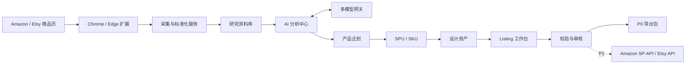

# YummyAI ERP 产品需求文档（PRD）

| 项目     | 内容                                                    |
| -------- | ------------------------------------------------------- |
| 文档版本 | V1.0                                                    |
| 日期     | 2026-07-17                                              |
| 产品形态 | 内部优先使用，架构预留多租户 SaaS                       |
| 首期平台 | Amazon、Etsy                                            |
| 首期目标 | 商品采集到可上架 Listing 资产闭环                       |
| 目标容量 | 最多约 30 个店铺、5,000 单/日、100 名内部用户的扩展能力 |
| 当前约束 | 暂无真实店铺，P0 不以真实刊登和订单同步为验收条件       |

## 1. 产品概述

YummyAI ERP 面向 Amazon、Etsy 定制产品与 POD 产品团队，统一管理竞品研究、产品企划、设计资产、Listing 内容、自动刊登、订单、供应商、生产与物流。

系统首期聚焦以下闭环：

`浏览器扩展采集 -> 研究资料库 -> AI 分析 -> 产品企划 -> SPU/SKU -> 设计任务 -> Listing 草稿 -> 合规审核 -> 导出待上架包`

后续阶段接入官方店铺 API，扩展到自动上架、订单、定制设计、供应商生产、物流和财务经营闭环。

## 2. 背景与问题

跨境定制/POD 团队常见问题：

1. Amazon、Etsy 商品信息、套图、A+、评论和变体分散，研究结果无法沉淀。
2. 竞品资料、自有产品资料和可上架素材混放，存在误用与版权风险。
3. 产品企划、设计、文案和上架依赖表格与聊天工具，版本和责任人不清晰。
4. 不同平台字段、图片规格、变体规则和禁限售要求不同，重复工作多。
5. 大模型分析缺少统一输入、证据引用、成本控制和人工审核。
6. 定制订单包含文字、图片、留言、效果图确认等非标准流程，普通 ERP 难以覆盖。
7. 多供应商履约需要按成本、区域、时效和产能动态分单。

## 3. 产品目标与非目标

### 3.1 P0 目标

1. 一键采集当前用户可见的 Amazon、Etsy 商品详情，并形成可追溯快照。
2. 将竞品研究资料与自有/授权资产严格隔离。
3. 通过统一模型网关完成单品、竞品组和自有产品的多维分析。
4. 建立产品、设计与 Listing 的版本化协作流程。
5. 生成并审核 Amazon、Etsy 可上架草稿，支持平台校验和导出。
6. 为未来店铺、订单、供应链和 SaaS 化预留清晰的数据与权限边界。

### 3.2 P0 非目标

1. 不以真实自动上架、订单同步、物流跟踪为首期交付条件。
2. 不通过浏览器自动化模拟卖家后台上架；P1 只使用平台允许的官方 API。
3. 不绕过登录、验证码、反爬、付费墙或平台访问限制。
4. 不提供自动侵权判定或法律结论。
5. 不允许竞品图片、A+ 或文案直接进入可上架资产库。
6. 不在 P0 建设完整广告、财务、仓储和采购系统。

## 4. 成功指标

### 4.1 北极星指标

试运行后，单个产品从开始调研到形成“审核通过、可导出的 Listing 资产”的平均时间，相比现有纯人工流程降低至少 50%。

### 4.2 P0 指标

| 指标                     | 目标                                 |
| ------------------------ | ------------------------------------ |
| 核心结构化字段采集准确率 | 代表性测试页面不低于 95%             |
| 可访问媒体采集成功率     | 不低于 98%，受保护内容需明确标记     |
| AI 事实结论证据覆盖率    | 100% 带证据，或明确标记为推断        |
| Listing 字段完整度       | 导出前必填项 100% 通过               |
| Listing 一次审核通过率   | 试运行后持续提升，作为团队指标展示   |
| 常规页面响应时间         | P95 小于 2 秒                        |
| 设计资产复用率           | 可按产品、模板和设计师统计           |
| AI 成本可追踪率          | 每次模型调用 100% 可归属到任务和组织 |

## 5. 用户与权限角色

| 角色         | 核心职责                                           |
| ------------ | -------------------------------------------------- |
| 组织管理员   | 成员、角色、权限、模型、平台与系统配置             |
| 选品/运营    | 采集、研究、分组、对比、创建产品企划               |
| 产品经理     | 产品立项、SPU/SKU、定制项、成本与供应商候选        |
| 设计师       | 设计任务、源文件、效果图、生产文件与版本           |
| Listing 运营 | 平台文案、关键词、图片槽位、属性和变体映射         |
| 审核人员     | 版权、合规、利润、设计和 Listing 审批              |
| 只读访客     | 查看授权范围内的报告和资料，不可修改或导出敏感资产 |

权限分为三层：菜单权限、操作权限、数据范围。数据范围至少支持本人、所在团队、全组织。所有业务记录必须带租户标识，不允许跨组织查询。

## 6. 关键术语

| 术语     | 定义                                                    |
| -------- | ------------------------------------------------------- |
| 采集快照 | 某 URL 在某一时间点的结构化字段、媒体索引和原始来源记录 |
| 研究资料 | 只用于分析、对比和企划的外部商品资料                    |
| 授权资产 | 企业拥有或已获得使用权，可进入设计与 Listing 流程的内容 |
| 产品企划 | 从市场机会到产品定义的业务文档，可转为 SPU              |
| SPU/SKU  | 标准产品单元及其可销售规格组合                          |
| 定制项   | 买家需要提供的文字、图片、颜色、日期或其他个性化输入    |
| 设计资产 | 需求、参考资料、源文件、效果图、生产文件及其版本        |
| Listing  | 面向具体平台、站点和语言的商品刊登内容版本              |
| 证据引用 | AI 结论所依据的采集字段、图片、评论或企业内部数据定位   |

## 7. 总体信息架构

导航按业务链路分组，不按后端模块平铺。未启用、无权限或尚未通过真实数据验收的能力必须明确显示不可用状态，不得用演示数据填充。

| 分组     | 一级入口                                     | 主要任务                                           |
| -------- | -------------------------------------------- | -------------------------------------------------- |
| 总览     | 运营总览、行动中心                           | 查看真实经营/生产信号，处理待办、阻断、异常和对账  |
| 研究     | 采集中心、研究资料库、竞争店铺、AI 分析      | 从公开证据发现机会并形成可追溯结论                 |
| 商品     | 产品目录、设计校样、Listing 工作台、发布中心 | 将批准企划推进为可生产、可审核、可导出或可发布版本 |
| 交易履约 | 店铺运营、订单、生产、物流、售后             | 在官方授权和 PII 隔离下完成平台与履约操作          |
| 供应链   | 供应商、库存、采购补货、渠道库存             | 管理真实供应、库存事实和人工对账                   |
| 经营洞察 | 财务利润、供应商绩效、广告与 VOC、预测       | 基于固定数据口径生成可下钻、可审阅的经营证据       |
| 系统     | 自动化、集成、权限、审计、设置               | 管理规则、连接、安全边界和系统证据                 |

### 7.1 页面层级

1. 首页回答“现在是否正常、今天要处理什么、下一步去哪里”，不承担所有模块的完整报表。
2. 列表页负责搜索、筛选、排序、批量选择、分页、保存视图和跨实体扫描。
3. 详情页负责单一实体的概览、关联记录、活动历史、健康状态和明确操作。
4. 编辑页将主要内容、平台校验、预览、版本和审核上下文放在同一工作区，减少跨页切换。
5. 技术连接参数、凭证、权限范围和能力同步放在设置层，不与日常店铺运营指标混排。

### 7.2 操作体验原则

1. 侧栏分组稳定；待审、异常和失败数量可显示徽标，但只能来自真实查询。
2. 重要指标必须显示时间范围、数据新鲜度、完整度或不可用原因，并可下钻到来源记录。
3. 全局搜索按租户和权限检索研究项、产品、SKU、Listing、店铺、订单和任务；筛选状态写入 URL。
4. 产品、Listing、店铺和订单列表优先使用可扫描表格，包含人类可识别名称，内部 ID 作为次要信息。
5. 不使用无法解释的综合 SEO 分、系统健康分或节省工时。建议与硬校验分开显示，并说明计算口径。
6. 发布、库存、采购和财务外部写入不得成为无门禁的一键操作；继续执行审批、版本、权限、幂等和对账约束。

## 8. 系统边界与数据流

竞品快照不能直接转换为可发布素材。系统只允许经人工确认的分析结论、产品企划和新创作内容进入授权资产域。

## 9. P0 详细功能需求

### 9.1 首页看板

**目标：** 展示当前真实工作，而不是在没有店铺时伪造销售订单指标。

| 编号    | 需求                                                                             | 优先级 |
| ------- | -------------------------------------------------------------------------------- | ------ |
| DASH-01 | 展示今日/本周采集数量、成功率、部分成功和失败数量                                | P0     |
| DASH-02 | 展示 AI 分析排队、运行、成功、失败、费用和模型分布                               | P0     |
| DASH-03 | 展示产品漏斗：研究中、待立项、设计中、Listing 中、待审核、可导出                 | P0     |
| DASH-04 | 展示设计任务、逾期任务、审核退回和工作量                                         | P0     |
| DASH-05 | 展示 Listing 完整度、平台分布、风险项和审核状态                                  | P0     |
| DASH-06 | 提供“我的待办”、最近操作和异常快捷入口                                           | P0     |
| DASH-07 | P2 上线后支持切换订单经营看板                                                    | P2     |
| DASH-08 | 所有摘要、风险和流水线节点可下钻到已筛选的真实工作队列                           | P0     |
| DASH-09 | 建立行动中心，聚合待审核、逾期、失败任务、授权异常、发布/库存/财务对账和售后异常 | P1     |
| DASH-10 | 指标显示时间范围、数据新鲜度和不可用原因；未授权平台数据不得显示为 0             | P1     |

### 9.2 浏览器扩展与采集中心

#### 9.2.1 支持范围

P0 支持 Chrome 与 Edge 的当前稳定版，页面范围包括：

- Amazon 商品详情页：ASIN、站点、标题、品牌、类目线索、价格、优惠、主图、套图、视频索引、五点、描述、A+ 模块文字与图片、变体、评分、评论数、可见评论、卖家/配送信息、Product information 全部分组参数与公开链接，以及页面 URL。
- Etsy 商品详情页：Listing ID、标题、店铺、价格、主图、套图、视频索引、描述、分类、属性、变体、个性化字段、标签、评分、评论数、可见评论、配送承诺和页面 URL。
- Etsy 商品详情页中可选的 EHunt 商品分析面板：仅当该第三方扩展已经把有效数据渲染到当前页面时，保存可见指标、类目和商品标签，并与 Etsy 原生证据分开标记来源。
- Etsy 公开店铺页：店铺身份、经营信号、公开简介与政策，以及页面报告的全部、促销和商品分类标签、商品数量与稳定分类链接。
- Etsy 公开店铺页中可选的 EHunt 店铺分析面板：保存顶部可见汇总和用户当前打开的一个页签，不自动遍历页签；面板缺失不改变 Etsy 原生采集状态。

“所有内容”定义为当前登录状态下、商品详情页面向用户正常展示且扩展能够合法访问的内容，不包含受保护接口、不可见后台数据或需要绕过限制的资源。

#### 9.2.2 功能需求

| 编号   | 需求                                                                                                                    | 优先级 |
| ------ | ----------------------------------------------------------------------------------------------------------------------- | ------ |
| CAP-01 | 自动识别平台、站点和页面类型，不支持时明确提示                                                                          | P0     |
| CAP-02 | 点击采集后先展示字段与媒体预览，用户可取消字段或媒体                                                                    | P0     |
| CAP-03 | 上传结构化数据、页面元信息和媒体，显示分阶段进度                                                                        | P0     |
| CAP-04 | 记录来源 URL、采集时间、平台、扩展版本和解析器版本                                                                      | P0     |
| CAP-05 | 同 URL 已存在时提供“更新快照”或“创建新研究记录”                                                                         | P0     |
| CAP-06 | 允许部分成功，逐项展示缺失字段与失败媒体                                                                                | P0     |
| CAP-07 | 媒体上传支持失败重试、去重、校验和断点恢复                                                                              | P0     |
| CAP-08 | 采集前选择“自有/已授权”或“竞品研究”，默认竞品研究                                                                       | P0     |
| CAP-09 | 自有/已授权内容升级为授权资产前必须填写权利来源                                                                         | P0     |
| CAP-10 | 页面结构无法识别时允许提交解析问题，但不上传登录凭证                                                                    | P0     |
| CAP-11 | 商品快照保存公开店铺名/链接、预计送达区间、处理时间、运费、发货地、配送目的地、发布日期和收藏数；字段缺失时逐项记录诊断 | P0     |
| CAP-12 | 预计送达天数以页面公开日期区间和快照采集日计算，界面同时保留原始日期文本并标明计算结果，不得在来源缺失时臆测            | P0     |
| CAP-13 | 店铺快照按页面顺序保存标签名称、平台分类 ID、页面报告商品数和稳定链接；不得为平台未公开目标的标签臆造链接             | P0     |
| CAP-14 | Etsy 页存在有效 EHunt 商品分析面板时保存其可见数据并标为第三方证据；面板不存在时省略字段，不读取其凭证或隐藏请求      | P0     |
| CAP-15 | Etsy 店铺页存在有效 EHunt 面板时保存顶部汇总和当前活动页签；不得自动切换页签或从不可读图表推断数据                  | P0     |

#### 9.2.3 采集状态机

`待采集 -> 解析中 -> 待确认 -> 上传中 -> 标准化中 -> 已完成 / 部分完成 / 失败 / 已取消`

失败任务保留错误分类、失败阶段、可重试项和诊断 ID。

### 9.3 研究资料库

| 编号   | 需求                                                                                           | 优先级 |
| ------ | ---------------------------------------------------------------------------------------------- | ------ |
| RES-01 | 支持卡片、列表两种视图和批量操作                                                               | P0     |
| RES-02 | 按标题、平台、站点、统一产品类型、分类状态、价格带、评分、风格、节日和标签筛选；支持显式多选批量归类 | P0     |
| RES-03 | 支持自定义研究项目和竞品分组                                                                   | P0     |
| RES-04 | 展示同 URL 多次采集的快照时间线和字段变化                                                      | P0     |
| RES-05 | 支持收藏、备注、负责人、研究状态和团队协作                                                     | P0     |
| RES-06 | 支持选择 2-20 个商品发起横向 AI 分析                                                           | P0     |
| RES-07 | 研究资料与授权资产在页面、接口、文件路径和权限上隔离                                           | P0     |
| RES-08 | 支持从研究结论创建产品企划，不复制竞品媒体到授权资产                                           | P0     |
| RES-09 | 证据列表展示最新快照的店铺名；商品档案展示主图、店铺、物流、类目、发布日期、收藏及倒序版本记录 | P0     |

统一产品类型属于可变研究索引，与不可变的 Amazon/Etsy 原始类目证据分开保存；每个研究条目只有一个主类型，风格、节日和用途仍使用多标签。系统依次使用原生 taxonomy、EHunt `categoryPath` 和 Amazon Product Information 中的 Best Sellers Rank 最具体类目生成待复核建议，不从标题、商品标签或 Handmade/Customizable 标记猜测类型。人工确认会学习租户隔离的原始类目别名并级联修正相同待复核建议，已确认条目不被后续采集覆盖。

### 9.4 多模型 AI 分析中心

#### 9.4.1 模型接入

系统通过统一模型网关接入文本、多模态和图片生成模型。管理员可配置 Claude、GLM、GPT 系列及其他兼容模型；界面可配置 Claude Opus 4.8、GLM 5.2、GPT 5.6 等模型标识，但只有在对应供应商实际开放 API 时才能启用。具体型号不在业务代码中写死。

支持：

1. 平台托管模型凭证与用户自带 API Key。
2. 按任务类型设置首选模型、备用模型、超时和重试次数。
3. 按组织、用户、任务统计输入/输出 Token、图片数量、费用和耗时。
4. 设置日/月预算、单任务费用上限和超限审批。
5. 记录提示词模板版本、模型、参数、输入快照与输出版本。
6. 允许同一任务调用多个模型，生成独立报告或由评审模型汇总差异。

#### 9.4.2 分析任务

| 编号  | 任务           | 主要输出                                                       |
| ----- | -------------- | -------------------------------------------------------------- |
| AI-01 | 单竞品深度分析 | 定位、人群、场景、卖点、价格、内容、变体、定制体验、风险与建议 |
| AI-02 | 竞品组横向分析 | 对比矩阵、共性、空白机会、价格带、差异化方向                   |
| AI-03 | 自有产品诊断   | 产品、设计、图片、文案、变体、成本与合规问题                   |
| AI-04 | 自有产品对标   | 自有产品与竞品的差距、优先级和行动清单                         |
| AI-05 | 评论/VOC 分析  | 痛点分类、频次、期望、产品改进和预期管理建议                   |
| AI-06 | Listing 建议   | 标题、卖点、描述、关键词方向、图片脚本和平台适配建议           |
| AI-07 | 产品企划生成   | 目标人群、需求、差异化、规格、定制项、设计需求和风险           |
| AI-08 | 图片生成       | 产品图、场景图、信息图草稿及其生成记录                         |

#### 9.4.3 分析维度

市场定位、目标人群、购买动机、使用场景、核心卖点、价格、促销、变体、材质、工艺、定制方式、交付承诺、关键词、标题、五点、描述、Etsy 标签、主图、套图、视频、A+、评论痛点、店铺信任、差异化机会、生产难度、潜在成本、平台政策和知识产权风险。

#### 9.4.4 输出与治理规则

1. 输出区分“原始事实”“模型推断”“行动建议”。
2. 事实结论必须引用字段、图片、评论或内部记录；无证据时不得伪装为事实。
3. 网页内容视为不可信输入，只能作为数据，不得改变系统指令或触发工具调用。
4. AI 文案、产品企划和图片默认保存为草稿，人工确认后才能进入正式资产。
5. 图片生成只能使用已确认权利来源的参考资产；生成结果显示 AI 标识和完整生成记录。
6. 商标、版权、专利和禁限售输出是风险提示，必须提示人工或专业复核。
7. 分析失败时保留已完成步骤，可重试原模型或切换备用模型。

### 9.5 产品管理

| 编号    | 需求                                                                                           | 优先级 |
| ------- | ---------------------------------------------------------------------------------------------- | ------ |
| PROD-01 | 从零创建或从 AI/研究结论创建产品企划                                                           | P0     |
| PROD-02 | 企划包含市场、人群、场景、差异化、规格、成本目标、风险和负责人                                 | P0     |
| PROD-03 | 审核通过的企划可创建 SPU，保留来源关系                                                         | P0     |
| PROD-04 | SPU 管理品牌、类目、材质、工艺、尺寸、重量、包装和生命周期                                     | P0     |
| PROD-05 | SKU 由规格维度组合生成，支持自定义编码规则                                                     | P0     |
| PROD-06 | 定制项支持文字、长文本、图片、日期、颜色、单选、多选和条件显示                                 | P0     |
| PROD-07 | 每个 SKU 可维护成本项、目标售价、币种和目标毛利                                                | P0     |
| PROD-08 | 产品关联设计、供应商候选、Listing 和研究来源                                                   | P0     |
| PROD-09 | 产品目录支持按名称、状态和负责人搜索筛选，展示成本目标、证据数量、定制字段、SPU/SKU 和更新时间 | P0     |
| PROD-10 | 产品目录与详情使用可深链 URL；空、无权限、失败和部分数据状态均需明确                           | P0     |

产品状态：

`研究中 -> 待立项 -> 已立项 -> 开发中 -> Listing 制作中 -> 可上架 -> 已归档`

未通过立项审核的产品不能进入正式设计与 Listing 流程。

### 9.6 供应商管理

P0 提供为后续生产路由所需的基础档案，不建设采购结算。

| 编号   | 需求                                             | 优先级 |
| ------ | ------------------------------------------------ | ------ |
| SUP-01 | 管理供应商基本信息、联系人、地址、结算币种和状态 | P0     |
| SUP-02 | 管理可生产产品、工艺、MOQ、打样费、阶梯价和交期  | P0     |
| SUP-03 | 管理服务国家、物流渠道、产能和黑名单地区         | P0     |
| SUP-04 | 保存资质、合同、报价单和有效期                   | P0     |
| SUP-05 | 产品/SKU 可绑定多个候选供应商和优先级            | P0     |
| SUP-06 | P2 按成本、时效、区域、质量和产能自动分单        | P2     |

### 9.7 设计管理

| 编号   | 需求                                                               | 优先级 |
| ------ | ------------------------------------------------------------------ | ------ |
| DES-01 | 从产品企划或 SKU 创建设计任务，设置负责人、截止时间和优先级        | P0     |
| DES-02 | 设计需求包含尺寸、印刷区域、色彩、出血、分辨率、文件格式和禁用元素 | P0     |
| DES-03 | 管理参考资料、版权来源、源文件、效果图、生产文件和图片脚本         | P0     |
| DES-04 | 每次上传形成新版本，支持对比、评论、退回和版本锁定                 | P0     |
| DES-05 | 审核通过版本可标记为主版本，并关联 SKU 与 Listing 图片槽位         | P0     |
| DES-06 | 支持设计模板和同一设计适配多产品、多尺寸                           | P0     |
| DES-07 | P2 支持模板自动出稿、人工设计直产、客户确认后生产三种流程          | P2     |

设计任务状态：

`待领取 -> 进行中 -> 待审核 -> 已通过 / 已退回 -> 已归档`

退回必须填写原因；已通过版本不可直接覆盖，只能创建新版本重新审核。

### 9.8 Listing 管理

#### 9.8.1 通用能力

| 编号   | 需求                                                                                                  | 优先级 |
| ------ | ----------------------------------------------------------------------------------------------------- | ------ |
| LST-01 | 一个产品可创建多个平台、站点、语言和店铺版本                                                          | P0     |
| LST-02 | 支持手工、AI 草稿和模板复制三种创建方式                                                               | P0     |
| LST-03 | 记录字段来源、编辑人、版本、审核意见和差异                                                            | P0     |
| LST-04 | 图片按平台槽位编排，显示规格与缺失项                                                                  | P0     |
| LST-05 | SKU 变体与平台变体主题/属性映射                                                                       | P0     |
| LST-06 | 实时计算字段完整度和阻塞问题                                                                          | P0     |
| LST-07 | 支持敏感词、绝对化用语、禁限售声明和知识产权风险提示                                                  | P0     |
| LST-08 | 审核通过前不可导出为正式上架包                                                                        | P0     |
| LST-09 | 支持多语言版本，但翻译结果必须单独审核                                                                | P0     |
| LST-10 | 从当前已批准版本复制同平台目标站点/语言草稿，并允许字段级本地化覆盖                                   | P1     |
| LST-11 | 复制记录固定源 Listing/版本、目标 Listing/版本、站点、语言、覆盖项和操作人，历史不可覆盖              | P1     |
| LST-12 | 每个目标站点/语言副本必须重新校验和审批，不继承源版本的批准状态                                       | P1     |
| LST-13 | Listing 目录支持搜索、平台/店铺/语言/状态/完整度筛选、排序、分页和批量选择                            | P0     |
| LST-14 | Listing 目录展示商品标题、主图、SPU/SKU、目标店铺、当前版本、完整度、阻断项和更新时间；缺失值明确显示 | P0     |
| LST-15 | 编辑器提供平台规则预览、版本活动、审核上下文和未保存离开保护；预览不得伪装为平台在线结果              | P0     |
| LST-16 | 批量操作只能对当前筛选结果中的显式选择项执行，并在提交前显示版本与门禁摘要                            | P1     |

#### 9.8.2 Amazon 模板

字段包括站点、类目、产品类型、标题、品牌、五点、描述、Search Terms、主图、套图、视频索引、A+ 规划、变体主题、属性、定价、包装、合规和目标受众。

P0 的 A+ 输出为模块规划、文字、图片资产与导出包；P1 在账号、品牌和 API 权限允许时接入真实 A+ 发布能力。

#### 9.8.3 Etsy 模板

字段包括店铺、标题、描述、分类、属性、13 个标签、材料、价格、数量、SKU、变体、个性化说明、主图、套图、视频、制作伙伴、处理时间和配送配置。

平台字段限制必须使用可配置规则，不在前端散落硬编码；规则更新需保留版本和生效日期。

Listing 状态：

`草稿 -> 编辑中 -> 待审核 -> 已退回 / 已通过 -> 已导出 -> P1 已发布 / 发布失败 / 已下架`

### 9.9 发布中心

| 编号   | 需求                                                                                                                                         | 优先级 |
| ------ | -------------------------------------------------------------------------------------------------------------------------------------------- | ------ |
| PUB-01 | P0 对 Listing 运行平台字段、素材、变体和风险校验                                                                                             | P0     |
| PUB-02 | 生成包含字段文件、图片、视频索引、A+ 规划和说明的导出包                                                                                      | P0     |
| PUB-03 | 导出记录包含内容版本、导出人、时间和校验结果                                                                                                 | P0     |
| PUB-04 | P1 通过 Amazon SP-API、Etsy API 创建草稿或发布                                                                                               | P1     |
| PUB-05 | P1 支持 2–100 项不可变批次、定时、幂等、防重复发布和失败重试；Amazon 批次预检通过后使用单个 JSON Listings Feed 正式提交，Etsy 按批次逐项激活 | P1     |
| PUB-06 | P1 回写平台 Listing ID、状态、错误和更新时间                                                                                                 | P1     |
| PUB-07 | P1 按已发布请求读取在线 Listing 的可写内容、价格与库存；保留观测时间、归一化快照和按动作范围计算的差异结果                                   | P1     |
| PUB-08 | P1 仅允许把当前已批准 Listing 版本的可写内容、价格与库存写入匹配店铺/站点；未知或部分写入结果进入人工对账，不自动重试                        | P1     |
| PUB-09 | P1 支持以 Listing 批准为触发器，按 Listing、平台、语言和完整度条件自动进入发布或在线同步队列                                                 | P1     |
| PUB-10 | 自动化规则可停用；每次匹配、跳过、入队或失败均保留租户隔离且不可变的运行记录                                                                 | P1     |

### 9.10 通知、审核与审计

1. 支持站内通知；邮件、企业微信、钉钉作为后续可选渠道。
2. 任务指派、临期、逾期、审核通过、退回、采集失败、AI 失败和预算超限触发通知。
3. 产品立项、设计定稿、Listing 审核、资产授权升级是 P0 审批节点。
4. 删除、恢复、导出、审批、权限修改、模型调用、凭证修改进入审计日志。
5. 业务数据进入回收站后保留 30 天再物理删除；审计日志至少保留 365 天。

## 10. P1-P3 功能规划

### 10.1 P1：店铺与自动刊登

1. Amazon、Etsy 店铺 OAuth/官方授权与权限健康检查。
2. 类目、属性、站点、变体、配送和税务模板同步。
3. 草稿发布、定时上架、批量上架和状态回写。
4. 在线 Listing 内容、价格和库存同步。
5. 多站点、多语言复制与差异覆盖。
6. 自动化规则：满足条件后进入审核、导出或发布队列。
7. 店铺运营列表展示连接状态、授权健康、能力新鲜度、最近同步和需处理事项；无真实平台事实时不展示销售指标。
8. 店铺详情按概览、Listing、订单、健康与设置分层；凭证和技术能力同步只出现在有权限的设置区域。

P1 在线 Listing 编排遵循以下约束：

1. 在线读取和写入必须引用一个已发布的不可变请求，以固定店铺、站点和外部 Listing ID；读取不修改平台，写入只使用当前批准版本中的平台发布字段。价格/库存动作保持窄语义，完整动作额外包含当前支持的文本、类目/配置和个性化字段。
2. 平台响应先归一化为与批准版本一致的动作范围再比较。`completed` 表示本次观测一致，`drift_detected` 表示存在差异；网络中断、未知结果或 Etsy 多步写入部分成功必须进入 `reconciliation_required`。
3. 多站点/多语言复制只创建新草稿和不可变血缘，不覆盖源 Listing，不复制批准状态，也不跨 Amazon/Etsy 转换平台字段。
4. 首个自动化触发器为 `listing_approved`，条件支持指定 Listing、平台、语言和最低完整度，动作支持发布预检/草稿或四种在线读取/写入动作。自动化不能绕过店铺授权、能力快照、资产权利、校验或 Listing 审批。
5. 批量发布固定 2–100 个同店铺、同站点目标，初始批次逐项生成预检/草稿，续发批次固定父项映射；Amazon 续发批次只创建一个 JSON Listings Feed，并按稳定 `messageId` 对账，Etsy 续发逐项激活。在线媒体同步、平台通知和更广泛的规则触发器/动作仍属于 P1 后续能力；媒体继续由不可变发布资产清单和独立上传步骤管理。

### 10.2 P2：订单、定制、供应链与物流

1. 多店铺订单同步、去重、合单、拆单和风险拦截。
2. 结构化解析买家文字、图片、定制选项和留言。
3. 按产品配置自动模板、人工设计直产、客户确认后生产三种流程。
4. 供应商询价、采购单、生产单、智能分单和人工改派。
5. 智能分单维度：产品能力、区域、成本、交期、产能、质量和优先级。
6. Printify、Printful 等 POD 平台作为特殊供应商连接器接入。
7. 质检、重做、补发、取消、异常和责任归因。
8. 面单、承运商、物流轨迹、时效预警和平台回传。
9. 售后、退款、退货、客户消息和客户确认记录。

订单主状态建议：

`待处理 -> 待定制资料 -> 待设计 -> 待客户确认 -> 待分单 -> 生产中 -> 待质检 -> 待发货 -> 已发货 -> 已完成`

异常状态与主状态并行，包括地址异常、资料缺失、设计超时、客户超时、生产异常、物流异常、取消、退款、重做和补发。

### 10.3 P3：完整经营闭环

1. 库存、仓库、批次、调拨、采购与补货。
2. FBA、FBM、海外仓、在途库存和虚拟库存。
3. 平台回款、佣金、广告、FBA 费、头程、采购、物流、汇率、税费和利润。
4. 供应商质量、交期、价格、响应和产能绩效。
5. 广告、关键词、评论、VOC 和客户服务。
6. 销售预测、库存预测、利润分析和经营驾驶舱。
7. 开放 API、Webhook、第三方应用和自动化工作流。

## 11. 建议补充模块

除原始需求外，完整 ERP 建议增加：

1. **数字资产与版权管理：** 记录授权范围、有效期、来源、设计归属和使用历史。
2. **定制字段模板：** 统一平台个性化输入与内部生产字段，避免订单靠人工读留言。
3. **利润与定价：** 在产品和 Listing 阶段提前计算平台费、生产、物流与目标毛利。
4. **质量管理：** 打样、质检标准、缺陷类型、重做和供应商责任。
5. **售后与客户确认：** 效果图确认、消息记录、超时规则、退款与补发。
6. **自动化规则引擎：** 用条件与动作连接审核、分单、预警、发布和通知。
7. **合规中心：** 平台政策、禁限售、敏感词、商标和版权风险记录。
8. **开放集成中心：** 官方平台 API、POD 平台、物流、对象存储、模型和 Webhook。
9. **数据治理：** 指标口径、数据血缘、版本、审计、导出和删除策略。

## 12. 核心数据模型

| 实体                                          | 关键关系                                 |
| --------------------------------------------- | ---------------------------------------- |
| Organization / User / Role                    | 租户、成员、角色与数据范围               |
| Store / MarketplaceAccount                    | P1 店铺与平台授权                        |
| CaptureTask / ProductSnapshot                 | 采集任务、URL、平台、快照版本和媒体      |
| ResearchProject / CompetitorGroup             | 研究项目与竞品组合                       |
| AIJob / AIReport / Evidence                   | 模型任务、输出版本、费用和证据引用       |
| ProductPlan / SPU / SKU                       | 企划、产品与规格组合                     |
| CustomizationSchema                           | 定制字段、校验、条件显示与生产映射       |
| Supplier / SupplierCapability                 | 供应商、工艺、报价、区域、产能和交期     |
| DesignTask / DesignAsset / AssetVersion       | 设计任务、权利来源、文件与版本           |
| Listing / ListingVersion / ListingAsset       | 平台内容、版本、图片槽位和字段来源       |
| Review / Comment / AuditLog                   | 审批、协作和审计                         |
| ExportJob / PublishJob                        | 导出与 P1 发布任务                       |
| Order / ProductionOrder / Shipment            | P2 订单、生产与物流                      |
| Warehouse / InventoryLedger / Balance         | P3 仓库、不可变库存事实与可重建投影      |
| FinancialFact / ProfitRun / SupplierScorecard | P3 财务事实、版本化利润与供应商绩效      |
| ForecastRun / MetricSnapshot / Reconciliation | 固定输入预测、经营指标快照与对账证据     |
| ApiClient / WebhookEvent / DeliveryAttempt    | 最小权限客户端、签名事件、重试与死信历史 |

所有实体应使用不可跨租户复用的标识；文件访问必须同时校验租户、业务权限和有效期。

## 13. 关键业务规则

1. 竞品研究记录默认不能创建可发布图片资产。
2. 只有填写权利来源并通过审核的内容才能升级为授权资产。
3. AI 输出不自动覆盖人工字段；采纳时形成新版本并记录来源。
4. 已审核版本不可直接修改，修改后自动回到待审核前状态。
5. 导出和发布必须锁定具体 Listing 版本，避免审核后内容漂移。
6. 同一平台、店铺和外部 Listing ID 的发布任务必须幂等。
7. 产品、设计或 Listing 归档不删除历史引用。
8. 供应商停用后不能用于新分单，但历史订单保持可追溯。
9. 订单主状态与异常状态分离，避免异常处理破坏履约主流程。
10. 预测、指标快照和经营建议只生成分析证据，不直接修改库存、采购、Listing、广告或财务事实。
11. 开放 API 客户端只能获得创建者已有的只读权限；租户由凭据记录解析，调用方不能选择。
12. Webhook 使用租户端点密钥签名，尝试与死信历史不可覆盖；人工重放创建带来源关系的新投递。

## 14. 非功能需求

### 14.1 性能与容量

1. 常规列表、筛选和详情请求 P95 小于 2 秒。
2. 采集、媒体处理、AI 分析、导出和发布均使用异步任务，不阻塞交互。
3. 初期按小团队部署，架构支持扩展到约 30 个店铺、5,000 单/日和 100 名用户。
4. 大文件采用分片或可恢复上传，限制值由管理员配置。

### 14.2 可用性与恢复

1. 异步任务必须有进度、超时、取消、失败原因和重试入口。
2. 外部模型或平台不可用时，不影响已保存数据的浏览与编辑。
3. 发布、订单同步等关键任务使用幂等键，避免重复执行。
4. 数据库和对象存储需要定期备份及可验证的恢复流程。

### 14.3 安全与隐私

1. API Key、店铺 Token 和敏感配置加密存储，前端不可回显明文。
2. 文件使用私有存储和短时签名链接。
3. 关键接口进行租户隔离、越权、注入、上传和速率限制测试。
4. 发送给模型的数据必须可预览、可配置脱敏并记录供应商去向。
5. 支持按组织删除模型凭证和停止后续模型调用。

### 14.4 可维护性

1. 平台解析器、平台字段规则和模型适配器必须模块化、可版本化。
2. 平台字段限制和校验规则由配置中心管理，并记录生效版本。
3. 外部连接器必须具备统一健康检查、错误分类和调用日志。

## 15. 错误处理原则

| 场景             | 系统行为                                           |
| ---------------- | -------------------------------------------------- |
| 页面结构变化     | 保存可解析部分，标记缺失项和解析器版本             |
| 媒体下载失败     | 不阻塞结构化字段，提供单项重试                     |
| 重复采集         | 提示更新快照或新建记录，不静默覆盖                 |
| AI 超时          | 保留上下文与已完成步骤，允许重试或切换模型         |
| AI 格式错误      | 执行结构校验与有限重试，仍失败则保留原始响应供诊断 |
| 预算超限         | 阻止新调用，通知用户并进入审批或等待下个周期       |
| Listing 校验失败 | 精确定位字段并阻止导出/发布                        |
| 平台 API 限流    | P1 延迟重试并展示预计恢复时间，不高频冲击接口      |
| 文件无权访问     | 返回统一无权限结果并记录安全日志，不泄露文件存在性 |

## 16. P0 验收方案

### 16.1 采集验收

1. 选择 50 个 Amazon 和 50 个 Etsy 代表页面，覆盖不同类目、变体、A+、视频和个性化选项。
2. 核心字段准确率不低于 95%。
3. 可访问媒体采集成功率不低于 98%。
4. 重复采集、部分失败、媒体重试和快照对比均可复现。
5. 不支持或受保护内容有明确说明，不出现静默丢失。

### 16.2 AI 验收

1. 单品、竞品组、自有产品和对标分析均能生成结构化报告。
2. 所有事实结论带证据引用；推断与建议清晰标记。
3. 模型、提示词版本、费用、耗时和输入快照可追溯。
4. 超时、错误格式、预算超限和备用模型流程可验证。
5. AI 图片只能使用已批准参考资产，输出保留完整生成记录。

### 16.3 产品、设计与 Listing 验收

1. 任一研究结论可创建产品企划，并经审核生成 SPU/SKU。
2. 设计任务可完成上传、版本、退回、审核和关联 SKU。
3. Amazon、Etsy Listing 均可完成编辑、校验、审核和导出。
4. 竞品媒体无法通过前端或接口直接进入可发布资产域。
5. 已审核内容发生变更后必须重新审核。

### 16.4 权限与安全验收

1. 租户隔离、角色越权、文件越权和批量导出纳入自动化测试。
2. API Key 与店铺 Token 不在日志、接口响应或页面中明文出现。
3. 删除、导出、审批、权限修改和模型调用均可在审计日志查询。

## 17. 版本路线

| 阶段 | 业务闭环                                                | 阶段完成标志                        |
| ---- | ------------------------------------------------------- | ----------------------------------- |
| P0   | 采集 -> 分析 -> 产品 -> 设计 -> Listing -> 审核 -> 导出 | 无店铺也能完成并验收可上架资产包    |
| P1   | 店铺授权 -> 平台校验 -> 自动刊登 -> 状态回写            | 在真实测试店铺完成官方 API 发布闭环 |
| P2   | 订单 -> 定制设计 -> 智能分单 -> 生产 -> 物流 -> 售后    | 真实订单可端到端履约并回传平台      |
| P3   | 库存 -> 采购 -> 财务 -> 广告 -> 经营分析                | 形成成本、利润和经营管理闭环        |

P0 应优先交付纵向闭环，不按菜单逐个堆模块。推荐迭代顺序：

1. 租户、用户、文件、任务和审计基础。
2. 扩展采集、标准化、研究资料库。
3. 多模型网关、AI 分析与证据系统。
4. 产品企划、SPU/SKU、定制项与成本。
5. 设计任务、数字资产和版权来源。
6. Amazon/Etsy Listing、校验、审核和导出。
7. 首页看板、指标、异常和整体体验优化。

## 18. 风险与应对

| 风险                   | 应对                                                     |
| ---------------------- | -------------------------------------------------------- |
| 平台页面频繁变化       | 解析器版本化、代表页面回归测试、部分成功和快速修复机制   |
| 平台限制采集           | 只采集用户可见内容，不绕过限制；店铺数据后续使用官方 API |
| 竞品素材侵权           | 研究与授权资产隔离、权利来源、审批、审计和风险提示       |
| 模型幻觉               | 证据引用、事实/推断分层、结构校验和人工审核              |
| 模型成本失控           | 预算、限额、路由、缓存、批处理和费用归属                 |
| 模型供应商变化         | 统一网关和适配器，不写死型号与供应商                     |
| 首期范围过大           | P0 只验收采集到 Listing 导出的纵向闭环                   |
| 无真实店铺无法验证上架 | P0 使用平台规则与导出包验收，P1 获得授权后单独验收发布   |

## 19. 决策记录

1. 产品先内部使用，但数据模型与权限按多租户设计。
2. 履约模式按多供应商混合模式设计，未来支持规则自动分单和 POD 平台连接器。
3. 定制设计支持自动模板、人工直产和客户确认三种流程，由产品配置。
4. 自有/授权内容与竞品研究内容严格隔离。
5. 初期业务规模较小，但容量和组织模型按成长档设计。
6. 因当前没有店铺，先做采集到 Listing 资产闭环，再做自动刊登和订单。
7. AI 同时覆盖竞品、自有产品、多品对比、Listing 建议和图片草稿生成。
8. 模型通过统一网关动态配置，不对尚未确认开放的具体型号作硬性依赖。

## 20. POD 作图中心专项 PRD

POD 作图中心在现有设计资产、Listing 素材和订单个性化能力上扩展，不建立平行的商品、订单、文件或权限体系。专项需求以 [YummyAI POD 作图中心总 PRD](2026-08-03-yummyai-pod-workbench.md) 为公共基线，并按以下七个固定一级模块拆分：

1. [印花提取](pod-workbench/01-print-extraction.md)
2. [印花设计](pod-workbench/02-print-design.md)
3. [图案处理](pod-workbench/03-pattern-processing.md)
4. [侵权检测](pod-workbench/04-rights-risk.md)
5. [套图&标题](pod-workbench/05-listing-assets-and-titles.md)
6. [来图定制](pod-workbench/06-personalization.md)
7. [生产图](pod-workbench/07-production-artwork.md)

专项路线使用 POD-1、POD-2、POD-3 标记功能交付批次，但不改变本 PRD 的平台阶段边界：无店铺授权时只能形成经过审核的不可变导出包；发布、订单同步与状态回写继续通过支持的市场平台 API 和显式店铺授权实现。竞品证据始终不可转为可发布或可生产资产。
